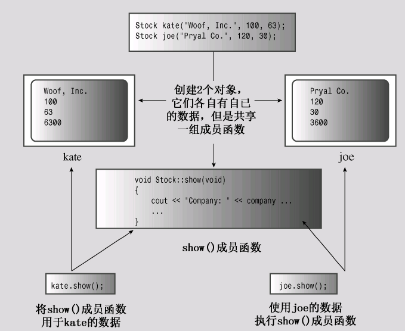

# Chap10.2 Abstract & Class

处理复杂性的方法之一是简化和抽象,也就是说，将问题的本质特征抽象出来，并根据特征来描述解决方案。

## 1.类型

需要按照存储方式,存储大小以及操作进行分配(指针不能进行模运算)

指定基本类型完成了三项基本工作

>决定数据对象需要的**内存数量**
>
>决定如何解释**内存中的位**
>
>决定可使用**数据对象执行的操作或方法**

**有关操作的信息被内置在编译器中,但是如果是用户定义的类型,需要自己提供**

## 2.C++中的类

**类被抽象为用户定义类型的C++工具,将数据表示和操作方法组合成一个包**

**<font color=red>和C的主要区别:用户现在可以定义自己的数据类型了</font>**

**类的规范包括:类声明和类方法定义**

>类声明:以数据成员的方式描述数据部分,以成员函数的方式描述公有接口
>
>类方法声明:描述如何实现类成员函数(接口的具体方法实现)

接口时一个共享框架,供两个系统(比如电脑和打印机)之间交互使用

>   对于类,公众(public)是使用类的程序,
>
>   交互系统由类对象组成,接口由方法组成
>
>   接口让程序员能够编写与类对象交互的代码,从而让程序使用类对象
>
>   >   比如统计字符数量,可以直接使用size()方法,无序打开对象
>   >
>   >   这个方法就是用户和String类对象之间的公共接口组成部分

**通常,接口(类定义)放在头文件中,将实现(类方法)放在源代码中**

**<font color=red>公共接口就是用户能看到的部分,有些逻辑的代码不用展示</font>**

```cpp
// 10.1 stock00.h
#ifndef STOCK00_H_
#define STOCK00_H_
#include<string>

// 类成员可以是数据类型,也可以是函数
class Stock //类名称称为这个类型的名称
{
private: //(数据隐藏)
    std::string company;
    long shares;
    double share_val;
    double total_val;
    void set_tot(){total_val = shares * share_val;}
public:
    void acquire(const std::string &co,long n,double pr);
    void buy(long num,double price);
    void sell(long num,double price);
    void update(double price);
    void show();
};
#endif
```

**1.控制访问**

>   使用`private`和`public`描述对类成员的访问控制
>
>   公有成员函数是程序和对象的私有成员之间的桥梁,提供了对象和程序的接口
>
>   防止程序直接访问数据被称为数据隐藏

**2.封装**

>   类设计尽可能将公有接口和实现细节分开
>
>   >   公有接口表示设计的抽象组件
>
>   如果将抽象 和 实现细节分开:则称为封装
>
>   **所以数据隐藏也是一种封装,将数据类型(private)和方法(public)分开**
>
>   >   这是在一个类之内的,类函数和类声明放在不同文件中也是

**3.控制对成员的访问:公有还是私有**

>   为了满足数据隐藏的目标:
>
>   数据项通常放在私有部分,组成类接口的成员函数放在公有部分
>
>   不用在类声明中使用关键字`private`,因为这是类对象的默认访问控制

```cpp
class World
{
    float mass;		// default private
    char name[20];	// default private
public:
    void tellall(void);
    // ...
}
```

## 3.实现类成员函数(.cpp)

(目的:为那些由类声明中表示的**原型**成员函数提供代码)

**方法的第一个特点:使用作用域运算符表示scope**

>   定义成员函数时,使用**作用域解析运算符来表示函数所属的类**
>
>   ```cpp
>   void Stock::update(double price); // 表示是Stock类的成员
>   void Buffon::update();			  // 表示是Buffon类的成员
>   ```
>
>   类方法可以访问类的`private`组件

**方法的第二个特点:方法可以访问类的私有成员**

>   ```cpp
>   // 在类中的show()方法!!
>   std::cout << company
>       << shares << endl
>       << share_val
>       << total_val << endl;
>   // 然而在非成员函数访问,编译器ERROR!!
>   ```

```cpp
// 10.1 stock00.h
#ifndef STOCK00_H_
#define STOCK00_H_
#include<string>

// 类成员可以是数据类型,也可以是函数
class Stock //类名称称为这个类型的名称
{
private: //(数据隐藏)
    std::string company;
    long shares;
    double share_val;
    double total_val;
    void set_tot(){total_val = shares * share_val;} //注意这里
public:
    void acquire(const std::string &co,long n,double pr);
    void buy(long num,double price);
    void sell(long num,double price);
    void update(double price);
    void show();
};
#endif
```

```cpp
// 10.2 stock00.cpp
// implementing Stock class
#include<iostream>
#include"stock00.h"
void Stock::acquire(const std::string & co,long n,double pr)
{
    company = co;
    if(n < 0)
    {
        std::cout << company << "\n";
        shares = 0;
    }
    else
        shares = n;
    share_val = pr;
    set_tot();
}
void Stock::buy(long num,double price)
{
    if(num < 0)
    {
        std::cout << "Transaction aborted" << endl;
    }
    else
    {
		share += num;
        share_val = price;
        set_tot();
    }
}
void Stock::sell(long num,double price)
{
	using std::out;
    if(num < 0)
    {
        cout << "Transaction aborted" << endl;
    }
    else if(num > shares)
    {
        cout << "Transaction aborted" << endl;
    }
    else
    {
        shares -= num;
        share_val = price;
        set_tot();
    }
}
void Stock::update(double price)
{
    share_val = price;
    set_tot();
}
void Stock::show()
{
    std::cout << company
        << shares <<'\n'
        << share_val;
    	<< total_val << '\n'
}
```

**1.成员函数说明**

>   `acquire()`函数表示对公司股票的首次购买.`buy()`和`sell()`管理股票数量
>
>   方法`buy()`和`sell()`确保买入或卖出的股数不为负数
>
>   4个成员函数设置或重新设置了`total_val()`成员函数(好习惯)
>
>   >如果每个函数都需要计算,最好就把它拿出来作为**辅助函数**
>   >
>   >然后设置为私有成员,不让用户看见

**2.内联方法**

>   定义位于类声明(.c的那个)中的函数都将自动成为内联函数
>
>   当然如果类声明以外需要内联函数,需要关键字`inline`
>
>   ```cpp
>   class Stock
>   {
>   private:
>       void set_tot();
>   public:
>       //...
>   };
>   inline void Stack::set_tot()
>   {
>       total_val = shares * share_val;
>   }
>   ```
>
>   内联函数的特殊规则:要求在每个使用它们的文件中都对其进行定义。
>
>   >   最好将内联定义放在定义类的头文件中（有些开发系统包含智能链接程
>   >   序，允许将内联定义放在一个独立的实现文件）。
>
>   **在类声明中定义方法等同于用原型替换方法定义**，然后在类声明的后面将定义改写为内联函数。也就是说，程序清单10.1中`set_tot( )`的内联定义与上述代码（定义紧跟在类声明之后）是等价的。

**3.方法使用哪个对象**

>   成员函数都是通用的,但是每个数据都有自己保存的位置
>
>   

## 4.使用类

现在来创建一个程序,创建和使用类对象

>   C++的目标:类和基本内置类型尽可能相同

```cpp
// 10.3 usestock0.cpp
#include<iostream>
#include"stock00.h"
int main()
{
    Stock fluffy_the_cat;
    fluffy_the_cat.acquire("NanoSmart",20,12.50);
    fluffy_the_cat.show();
    fluffy_the_cat.buy();
    fluffy_the_cat.sell(400,20.00);
    fluffy_the_cat.show();
    fluffy_the_cat.buy(300000,40.125);
    fluffy_the_cat.show();
    fluffy_the_cat.sell(300000,0.125);
    fluffy_the_cat.show();
    return 0;
}
```

>OOP程序员常依照客户/服务器模型来讨论程序设计。在这个概念中，客户是使用类的程序。类声明（包括类方法）构成了服务器，它是程序可以使用的资源。客户只能通过以公有方式定义的接口使用服务器，这意味着客户（客户程序员）唯一的责任是了解该接口。服务器（服务器设计人员）的责任是确保服务器根据该接口可靠并准确地执行。服务器设计人员只能修改类设计的实现细节，而不能修改接口。这样程序员独立地对客户和服务器进行改进，对服务器的修改不会客户的行为造成意外的影响。

## 5.修改实现

**可以使用`setf()`来避免科学计数法**

>   ```cpp
>   std::cout.setf(std::ios_base::fixed,std::ios_base::floatfileld);
>   ```

**可以使用`setprecision()`来使用定点表示法**

>   ```cpp
>   std::cout.precision(3);
>   ```

**需要随时重新调用`show()`来刷新操作后的值**

```cpp
void Stock::show()
{
    using std::cout;
    using std::ios_base;
    ios_base::fmtflags orig =
        cout.setf(ios_base::fixed,ios_base::floatfield);
    std::streamsize prec = cout.precision(3);
    cout << company
        <<shares <<"\n";
    cout << share_val;
    cout.precision(2);
    cout << total_val << "\n";
    cout.setf(orig,ios_base::floatfield);
    cout.precision(prec);
}
```

## 6.小结

指定类设计的第一步是提供类声明。

类声明类似结构声明，**可以包括数据成员和函数成员**。

声明有私有部分，在其中声明的成员只能通过成员函数进行访问；

声明还具有公有部分，在其中声明的成员可被使用类对象的程序直接访问。

通数据成员被放在私有部分中，成员函数被放在公有部分中,声明的格式如下：

```cpp
class className
{
private:
    data member declare;
public:
    member function;
};
```

>公有部分的内容构成了设计的抽象部分——公有接口。将数据封装到私有部分中可以保护数据的完整性，这被称为数据隐藏。因此，C++通过类使得实现抽象、数据隐藏和封装等OOP特性很容易。

****

指定类设计的第二步是实现类成员函数。

可以在类声明中提供完整的函数定义，而不是函数原型，但是通常的做法是单独提供函数定义（除非函数很小）。在这种情况下，需要使用**作用域解析运算符**来指出成员函数属于哪个类

要创建对象（类的实例），只需将类名视为类型名即可：`Bozo bozetta;`
这样做是可行的，因为类是用户定义的类型。
类成员函数（方法）可通过类对象来调用。为此，需要使用成员运算符句点：

```cpp
cout << Bozetta.Retort();
```

这将调用Retort( )成员函数，每当其中的代码引用某个数据成员
时，该函数都将使用bozetta对象中相应成员的值。