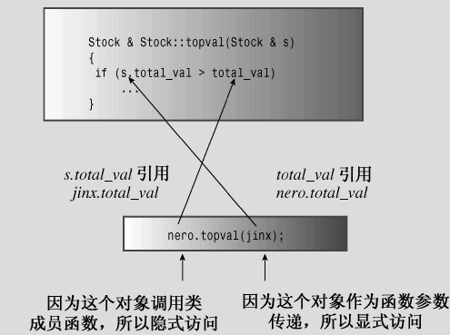
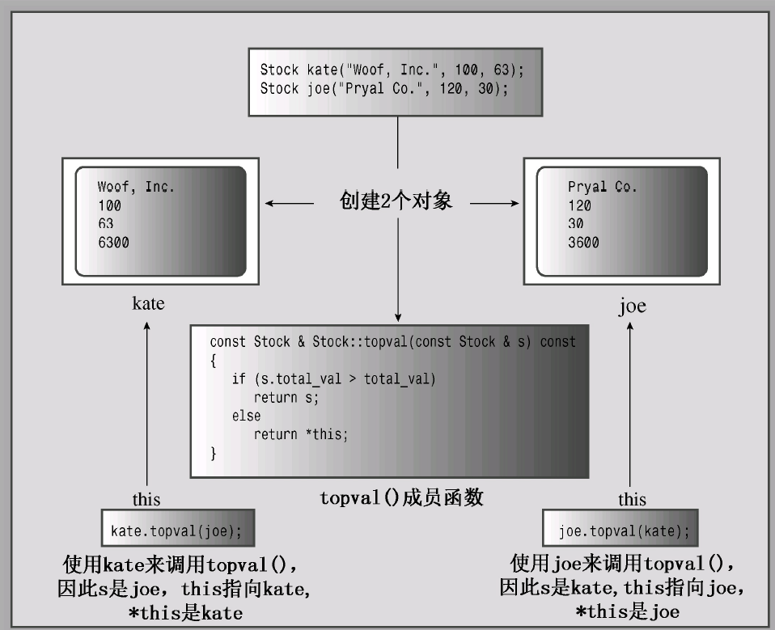
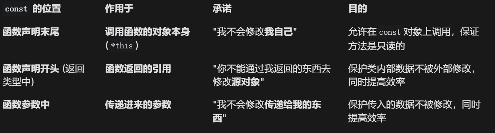

# Chap10.4 this pointer

如果方法涉及到两个对象,这个时候就需要使用C++的this指针

**如果存在任务:找到最高价格的股票**

方法1:一个一个读取值

```cpp
Class Stock
{
private:
    double total_val;
public:
    double total() const{return total_val;}
}
```

>   这种返回`total_val`的方法十分笨拙并且是只读的(不能修改)

方法2:定义一个成员函数观测两个值,返回股价较高的引用

```cpp
// 根据需求可以抽象出函数prototype
const Stock & topval(const Stock & s)const;
// 以下调用的两种方式都是正确的
top = stock1.topval(stock2);
top = stock2.topval(stock1);
// 一个作为调用对象(调用该函数的对象),一个作为参数对象
```

>   

```cpp
// 比较s对象和当前对象,返回价值更高的那个
const Stock & Stock::topval(const Stock &s)const
{
    if(s.total > total_val)
        return s;	// 如果s的价值更高,则返回s
    else
        return ???; // 如果另一个价值更高,则应该返回这个对象
}
```

>   在这个函数中,我们引用了`&s`(参数对象)所以可以直接使用`s`来引用
>
>   但是调用对象的引用无法在方法中返回引用

**最终方法:`this`指针**

>   `this`指针在任何**类的非静态成员函数内部**都会自动存在
>
>   **并且使用指向调用对象的内存地址**
>
>   所以可以直接使用解引用操作符`*`得到指向的对象本身(本体不是副本)
>
>   ```cpp
>   // 比较s对象和当前对象,返回价值更高的那个
>   const Stock & Stock::topval(const Stock &s)const
>   {
>       if(s.total > total_val) //if(s.total > this->total_val)
>           return s;	// 如果s的价值更高,则返回s
>       else
>           return *this; 
>   }
>   ```
>
>   然后其实这里也是一种对象成员的简化
>
>   

```cpp
// 10.7 stock20.h
#ifndef STOCK20_H_
#define STOCK20_H_
#include<string>
class Stock
{
private:
    std::string company;
    int shares;
    double shar_val;
    double total_val;
    void set_tot(){total_val = shares * share_val;}
public:
    Stock();
    Stock(const std::string &co,long n = 0,double pr = 0.0);
    ~Stock();
    void buy(long num,double price);
    void sell(long num,double price);
    void update(double price);
    void show()const;
    const Stock & topval(const Stock &s)const;
}
```

>RE:`const Stock & topval(const Stock &s)const;`
>
>第一个`const`:表示函数的返回类型是对常量的引用(保护内部数据)
>
>中间`const`:表示函数不会修改函数的参数变量
>
>最后`const`:const成员函数(函数不会修改调用它的对象)(保护调用对象)
>
>

```cpp
// 10.8 stock20.cpp
#include<iostream>
#include"stock20.h"
// constructor
Stock::Stock()
{
    company = "no name";
    shares = 0;
    share_val = 0.0;
    total_val = 0.0;
}
Stock::Stock(const std::String &co,long n,double pr)
{
    company = co;
    if(n < 0)
    {
        cout << "Shares can't be negative"
            << company << '\n';
        shares = 0;
    }
    else
        shares = 0;
    share_val = pr;
    set_tot();
}
// destructor
Stock::~Stock(){}
void Stock::buy(long num,double price)
{
    if(num < 0)
    {
        std::cout << "Transaction aborted.\n";
    }
    else
    {
        shares += num;
        share_val = price;
        set_tot();
    }
}
void Stock::sell(long num,double price)
{
    using std::cout;
    if(num < 0)
    {
        std::cout << "Transaction aborted.\n";
    }
    else if(num > shares)
    {
        std::cout << "Transaction aborted.\n";
    }
    else
    {
        shares -= num;
        share_val = price;
        set_tot();
    }
}
void Stock::update(double price)
{
    share_val = price;
    set_tot();
}
void Stock::show()const
{
	using std::cout;
    using std::ios_base;
    ios_base::fmtflags orig = 
        cout.setf(ios_base::fixed,ios_base::floatfield);
    std::streamsize prec = cout.precision(3);
    cout << "Company" << company
         << "Shares" << shares << '\n';
    cout << "Share Price" << share_val;
    cout.precision(2);
    cout << "Total worth" << total_val << '\n';
    cout.setf(orig,ios_base::floatfield);
    cout.precision(prec);
}
// 比较s对象和当前对象,返回价值更高的那个
const Stock & Stock::topval(const Stock &s)const
{
    if(s.total > total_val) //if(s.total > this->total_val)
        return s;	// 如果s的价值更高,则返回s
    else
        return *this; 
}
```

