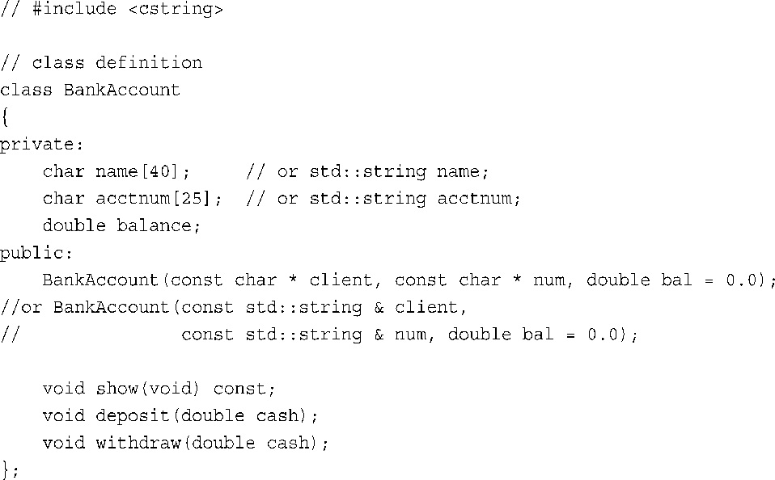
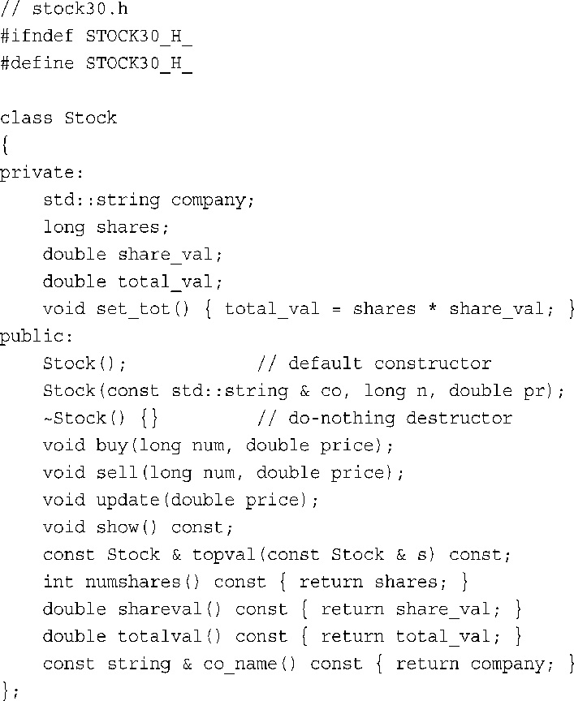

# Chap 10.8 Homework

## 1.Conclusion

面向对象编程强调的是程序如何表示数据。使用OOP方法解决编程问题的第一步是根据它与程序之间的接口来描述数据，从而指定如何使用数据。然后，设计一个类来实现该接口。**一般来说，私有数据成员存储信息，公有成员函数（又称为方法）提供访问数据的唯一途径。类将数据和方法组合成一个单元，其私有性实现数据隐藏。**

通常，将类声明分成两部分组成，这两部分通常保存在不同的文件中。**类声明（包括由函数原型表示的方法）应放到头文件中。定义成员函数的源代码放在方法文件中。这样便将接口描述与实现细节分开了。**
从理论上说，只需知道公有接口就可以使用类。当然，可以查看实现方法（除非只提供了编译形式），但程序不应依赖于其实现细节，如知道某个值被存储为int。只要程序和类只通过定义接口的方法进行通信，程序员就可以随意地对任何部分做独立的改进，而不必担心这样做会导致意外的不良影响。

类是用户定义的类型，对象是类的实例。这意味着对象是这种类型的变量，例如**由new按类描述分配的内存。C++试图让用户定义的类型尽可能与标准类型类似，因此可以声明对象、指向对象的指针和对象数组。可以按值传递对象、将对象作为函数返回值、将一个对象赋给同类型的另一个对象。**如果提供了构造函数，则在创建对象时，可以初始化对象。如果提供了析构函数方法，则在对象消亡后，程序将执行该函数。

每个对象都存储自己的数据，而共享类方法。如果`mr_object`是对象名，`try_me( )`是成员函数，则可以使用成员运算符句点调用成员函数：`mr_object.try_me( )`。在OOP中，这种函数调用被称为将try_me消息发送给`mr_object`对象。在`try_me( )`方法中引用类数据成员时，将使用`mr_object`对象相应的数据成员。同样，函数调用`i_object.try_me( )`将访问`i_object`对象的数据成员。

**如果希望成员函数对多个对象进行操作，可以将额外的对象作为参数传递给它。如果方法需要显式地引用调用它的对象，则可以使用this指针。由于this指针被设置为调用对象的地址，因此*this是该对象的别名。**
类很适合用于描述ADT。公有成员函数接口提供了ADT描述的服务，类的私有部分和类方法的代码提供了实现，这些实现对类的客户隐藏。

## 2.Homework

1．什么是类？

>类是用户定义的类型的定义。类声明指定了数据将如何存储，同时指定了用来访问和操纵这些数据的方法（类成员函数）。

2．类如何实现抽象、封装和数据隐藏？

>类表示人们可以类方法的公有接口对类对象执行的操作，这是抽象。
>
>类的数据成员可以是私有的（默认值），这意味着只能通过成员函数来访问这些数据，这是数据隐藏。实现的具体细节（如数据表示和方法的代码）都是隐藏的，这是封装。

3．对象和类之间的关系是什么？

>类定义了一种类型，包括如何使用它。对象是一个变量或其他数据对象（如由new生成的），并根据类定义被创建和使用。类和对象之间的关系同标准类型与其变量之间的关系相同。

4．除了是函数之外，类函数成员与类数据成员之间的区别是什么？

>   如果创建给定类的多个对象，则每个对象都有其自己的数据内存空间;但所有的对象都使用同一组成员函数（通常，方法是公有的，而数据是私有的，但这只是策略方面的问题，而不是对类的要求）。

5．定义一个类来表示银行帐户。数据成员包括储户姓名、账号（使用字符串）和存款。成员函数执行如下操作：

>   创建一个对象并将其初始化；
>   显示储户姓名、账号和存款；
>   存入参数指定的存款；
>   取出参数指定的款项。
>   请提供类声明，而不用给出方法实现。（编程练习1将要求编写实现）
>
>   

6．类构造函数在何时被调用？类析构函数呢？

>在创建类对象或显式调用构造函数时，类的构造函数都将被调用。当对象过期时，类的析构函数将被调用。

7．给出复习题5中的银行账户类的构造函数的代码。

>有两种可能的解决方案（要使用strncpy( )，必须包含头文件
>cstring或string.h;要使用string类，必须包含头文件string）：
>
>```cpp
>BankAccount::BankAccount(const char* cliant,const char * num,double bal)
>{
>    strncpy(name,client,39);
>    name[39] = '\0';
>    strncpy(acctnum,num,24);
>    acctnum = '\0';
>    balance = bal;
>}
>// 或者
>BankAccount::BankAccount(const std::string & cliant,const std::string & num,double bal)
>{
>    name = client;
>    acctnum = num;
>    balance = bal;
>}
>```

8．什么是默认构造函数，拥有默认构造函数有何好处？

>默认构造函数是没有参数或所有参数都有默认值的构造函数。
>拥有默认构造函数后，可以声明对象，而不初始化它，即使已经定义了
>初始化构造函数。它还使得能够声明数组。

9．修改Stock类的定义（stock20.h中的版本），使之包含返回各个
数据成员值的成员函数。注意：返回公司名的成员函数不应为修改数组
提供便利，也就是说，不能简单地返回string引用。

>   

10．this和*this是什么？

>this指针是类方法可以使用的指针，它指向用于调用方法的对象。因此，this是对象的地址，*this是对象本身。
