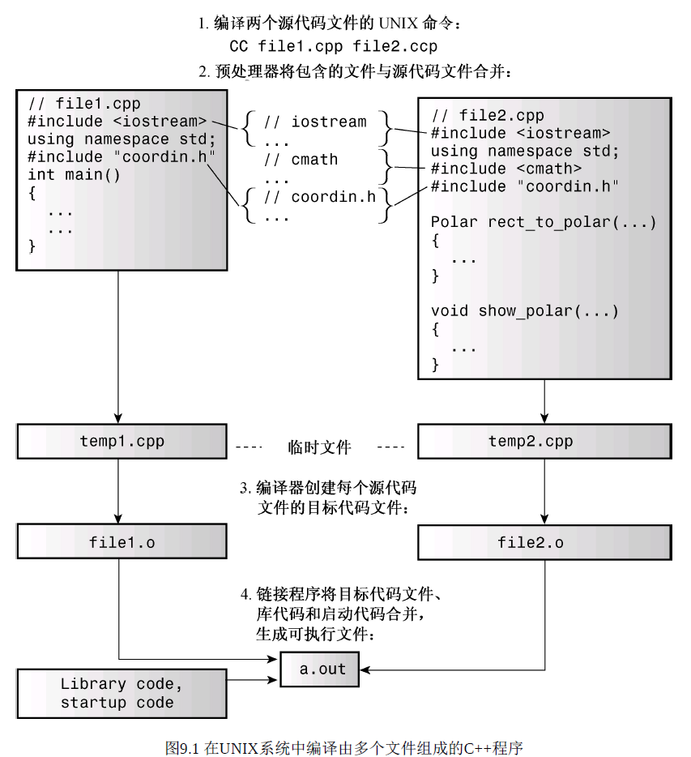

# 9.1 Single Compile

**C++处理文件**

>   可以单独编译,然后进行链接(link),只需要单独修改某个源文件重新编译即可
>
>   (大多数系统都有make程序,根据程序依赖的文件以及最后修改时间重新构建)

**大多数的做法**

>   不直接将一个程序直接拆分,而是使用`#include`将结构声明放在头文件中
>
>   ->如果想要修改结构声明,只需在头文件做改动即可

**程序**

>头文件：包含**结构声明和使用这些结构的函数**的原型。
>
>源代码文件：包含与**结构有关的函数**的代码。
>
>源代码文件：包含**调用与结构相关的函数**的代码。

**请不要将函数定义或变量声明放到头文件中。**

>   例如，如果在头文件包含一个函数定义，然后在其他两个文件（属于同一个程序）中包含该头文件，**则同一个程序中将包含同一个函数的两个定义**，除非函数是内联的，否则这将出错。

**头文件(不创建变量的声明)**

>**包含的内容**
>
>>   函数原型。使用#define或const定义的符号常量。结构声明。
>>
>>   类声明。模板声明。内联函数。
>
>**写法(`<>`和`""`)**
>
>>   如果写成`<>`,C++编译器将在存储标准头文件的主机系统的文件系统中查找
>>
>>   如果写成`""`,C++编译器器将首先查找当前的工作目录或源代码目录

```cpp
// 9.1 coordin.h 直角坐标和极坐标的代码
#ifndef COORDIN_H_
#define COORDIN_H_

struct Polar
{
    double distance;
    double angle;
};
struct rect
{
    double x;
    double y;
};
// prototypes
polar rect_to_polar(rect xypos);
void show_polar(polar dapos);
#endif
```

>   依然是分别编译,然后合并代码,产生临时文件,目标代码,最后link系统库等
>
>   

>   (1)`#ifndef` `#endif`的作用:避免多次包含同一个头文件
>
>   (如果没有使用`#define`定义名称,才使用`#ifndef`和`#endif`之间的)
>
>   ```cpp
>   #ifndef COORDIN_H_
>   // 从中间开始定义
>   #define COORDIN_H_
>   #endif
>   ```
>
>   (2)`#define`的主要作用是创建符号常量
>
>   ```cpp
>   #define MAXIMUM 4096
>   ```

```cpp
// 9.2 file1.cpp
#include<iostream>
#include"coordin.h"
using namespace std;
int main()
{
    rect rplace;
    polar pplace;
    cout << "Enter X Y" << endl;
    while(cin >> rplace.x >> rplace.y)
    {
        pplace = rect_to_polar(rplace);
        show_polar(pplace)
    }
}
```

```cpp
// 9.3 file2.cpp
#include<iostream>
#include<cmath>
#include"coordin.h"

polar rect_to_polar(rect xypos)
{
    using namespace std;
    polar answer;
    answer.distance =
        sqrt(xypos.x * xypos.x + xypos.y * xypos.y);
    answer.angle = atan2(xypos.y,xypos.x);
    return answer;
}
void show_polar(polar dapos)
{
	using namespace std;
    const double Rad_to_dog = 57.29577951;
    cout << dapos.distance;
    cout << dapos.angle * Rad_to_dog;
    cout << "degree \n";
}
```

**注意,这一小讲的Single Compile指的是单独在一个编译器中进行编译的**

>   所以导致编译器为函数生成的修饰名称是不冲突的(编译器方言)
>
>   如果有源代码,可以使用自己的编译器重新编译源代码来消除链接错误
