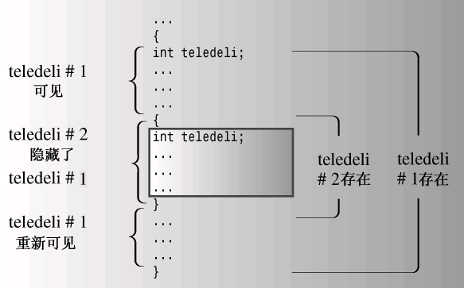
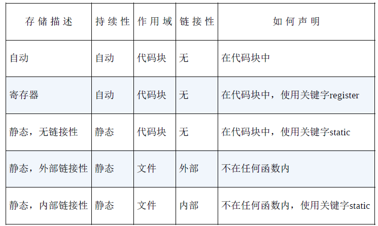

# 9.2 Storage persistence scope linkability

C++使用三种（在C++11中是四种）不同的方案来存储数据，这些方案的区别就在于数据保留在内存中的时间。

>**自动存储持续性**：在函数定义中声明的变量（包括函数参数）的存储持续性为自动的。**它们在程序开始执行其所属的函数或代码块时被创建，在执行完函数或代码块时，它们使用的内存被释放**。C++有两种存储持续性为自动的变量。
>
>**静态存储持续性**：**在函数定义外定义的变量和使用关键字static定义的变量的存储持续性都为静态。它们在程序整个运行过程中都存在。**C++有3种存储持续性为静态的变量。
>
>**动态存储持续性**：用new运算符分配的内存将一直存在，**直到使用delete运算符将其释放或程序结束为止。**这种内存的存储持续性为动态，有时被称为自由存储（free store）或堆（heap）。
>
>**线程存储持续性（C++11）**：当前，多核处理器很常见，这些CPU可同时处理多个执行任务。这让程序能够将计算放在可并行处理的不同线程中。**如果变量是使用关键字thread_local声明的，则其生命周期与所属的线程一样长**。本书不探讨并行编程。

## 1.作用域和链接

作用域（scope）描述了名称在文件（翻译单元）的多大范围内可见

>函数中定义的变量可在该函数中使用，但不能在其他函数中使用
>
>文件中的函数定义之前定义的变量则可在所有函数中使用

链接性（linkage）描述了名称如何在不同单元间共享

>   链接性为外部的名称可在文件间共享
>
>   链接性为内部的名称只能由一个文件中的函数共享
>
>   自动变量的名称没有链接性，因为它们不能共享

C++变量的作用域

>作用域为局部的变量只在定义它的代码块中可用(花括号间)
>
>>   例如函数体就是代码块，但可以在函数体中嵌入其他代码块
>
>作用域为全局（也叫文件作用域）的变量在定义位置到文件结尾之间都可用
>
>**自动变量**作用域为局部，**静态变量**的作用域是全局还是局部取决于如何定义的
>
>在**函数原型**作用域中使用的名称只在包含参数列表的括号内可用
>
>在**类**中声明的成员的作用域为整个类
>
>在**名称空间**中声明的变量的作用域为整个名称空间（由于名称空间已经引入
>到C++语言中，因此全局作用域是名称空间作用域的特例）
>
>**C++函数的作用域可以是整个类或整个名称空间,但不能是局部的**(如果函数的作用域为局部，则只对它自己是可见的，因此不能被其他函数调用。这样的函数将无法运行)

## 2.自动存储连续性

**在默认情况下，在函数中声明的函数参数和变量的存储持续性为自动，作用域为局部，没有链接性。**

>   如果在`main( )`中声明了一个名为`texas`的变量，
>
>   并在函数`oil( )`中也声明了一个名为`texas`变量，
>
>   则创建了两个独立的变量——只有在定义它们的函数中才能使用它们。
>
>   对`oil( )`中的`texas`执行的任何操作都不会影响`main( )`中的`texas`

另外，当程序开始执行这些变量所属的代码块时，将为其分配内存；当函数结束时，这些变量都将消失（注意，执行到代码块时，将为变量分配内存，但其作用域的起点为其声明位置）。

**如果函数名和局部变量名相同,会导致新定义隐藏之前的定义**

>   

自动变量只在包含它们的函数或代码块中可见。

```cpp
// auto.cpp
#include<iostream>
void oil(int x);
int main()
{
    using namespace std;
    int texas = 31;
    int year = 2021;
    cout << texas << " " << &texas << endl;
    cout << year << " " << &year << endl;
    oil(texas);
    cout << texas << " " << &texas << endl;
    cout << year << " " << &year << endl;
    return 0;
}
void oil(int x)
{
    using namespace std;
    int texas = 5;
    cout << texas << " " << &texas << endl;
    cout << x << " " << &x << endl;
    {
        int texas = 113;
        cout << texas << " " << &texas << endl;
        cout << x << " " << &x << endl;
    }
    cout << texas << " " << &texas << endl;
}
```

>   作用域是`{}`之间的内容,在上面的代码中,首先执行`mian()`的`{}`部分,然后遇到`oil()`函数后,`main()`的变量被遮蔽但是仍然存在
>
>   在`oil()`中,变量的副本(按值传递)被创建,进入内部`{}`,作用域仅在`{}`中

>   **按值传递/按指针传递/按引用传递**
>
>   按值传递是新创建变量(副本变量)比较容易理解
>
>   按指针传递和按引用传递都可以通过另一个函数作用`main()`函数的对象
>
>   >   **但是原因不是因为作用域不启用,任然不能用`main()`的变量名调用**
>   >
>   >   而是因为`main()`函数变量内存仍存在,变量仍在生命周期中

**1.自动变量初始化**

>   ```cpp
>   int w; // indeterminate
>   int x = 5; // initialized
>   int big = INT_MAX - 1; // initialized(CONSTANT)
>   int y = 2 * x; // use determinated value
>   ```
>

**2.自动变量和栈**

>   编译器对自动变量的实现随函数的开始和结束进行
>
>   程序在运行时对自动变量进行管理--留出一段内存(栈)通过双指针进行管理
>
>   ->当函数调用的时候,其自动变量被加入到栈中
>
>   ->栈顶指针指向栈的下一个可用内存单元
>
>   ->栈底指针指向栈的开始位置
>
>   ->当函数结束时,栈顶指针被重置,从而释放新变量使用的内存
>
>   ```cpp
>   // fib
>   // fib(3) Params n : 0x7fffae0a538c
>   // fib(2) Params n : 0x7fffae0a535c
>   // fib(1) Params n : 0x7fffae0a532c
>   // fib(0) Params n : 0x7fffae0a532c
>   
>   // 注意计算细节:16进制应该使用16计算
>   38c - 35c = 30 -> 3*16^1 + 0*16^0 = 48bit;
>   // 包括函数参数/返回地址/栈帧指针/局部变量/padding
>      
>   // 需要注意fib(1)和fib(0)地址相同的原因:生命周期错开了
>   // 不管先fib(0)还是fib(1),fib(2)需要两个计算结果,计算出一个另一个释放
>   // 所以导致了内存地址的相同
>   ```

**3.寄存器变量**

>关键字`register`是C提出的,建议编译器使用CPU寄存器存储自动变量
>
>```cpp
>register int count_fast; // register variable
>```
>
>**使用它的唯一目的是自动变量和外部变量的名称相同**
>
>(此功能在C++11被废除)

## 3.静态持续变量(`static`)

C++为静态存储持续性提供了3种链接性

>外部链接性(可在其它文件中访问)
>
>内部链接性(只在当前文件中访问)
>
>无链接性(只在当前函数或代码块中访问)

```cpp
int global = 1000; // static,external
static int one_file = 50; // static,internal
void func1(int n)
{
    static int count = 0; // static,no
}
```

**5种变量的存储方式**

>   

**静态变量的初始化方式:零值初始化/常量初始化(都是静态初始化)/动态初始化**

>零值初始化:对于标量类型,所有位置都被设置为0(合适的形式)
>
>常量初始化:首先进行零值初始化以后,然后根据文件内容计算表达式
>
>```cpp
>#include<cmath>
>int x;							// 零值初始化
>int y = 15;						// 常量初始化(常量值)
>long z = 13 * 13;				// 常量初始化(常量表达式)
>// 额外注意sizeof()也是一种常量表达式,以及C++11的constexpr
>const double pi = 4.0 * atan(1.0) // 动态初始化(需要链接atan())
>```

## 4.静态持续性/外部链接性

链接性为外部 的变量:外部变量,存储持续性为静态,作用域为整个文件

**静态持续性:具有静态持续性的变量的生命周期为整个程序**

**外部链接性:具有外部链接性的变量是通过`extern`关键字声明的**

**1.单定义规则**

>   变量只能有一次定义:定义声明/引用声明
>
>   ```cpp
>   double up;			// 定义声明,零值初始化
>   extern int blem;	// extern+不完整定义.视为引用
>   extern char qr = 'z'// extern+完整初始化,视为定义
>   ```
>
>   主要操作:使用关键字`extern`来重新声明以前定义过的外部变量
>
>   ```cpp
>   // 9.5 external.cpp
>   #include<iostream>
>   using namespace std;
>   double warming = 0.3;
>   void update(double dt);
>   void local();
>   int main()	
>   {
>   	cout << warming << endl;
>       update(0,1);
>       cout << warming << endl;
>       local();
>       cout << warming << endl;
>       return 0;
>   }
>   ```
>
>   ```cpp
>   // 9.6 support.cpp
>   #include<iostream>
>   extern double warming;
>   void update(double dt);
>   void local();
>   using std::out;
>   void update(double dt)
>   {
>       extern double warming;
>       warming += dt;
>       cout << warming << endl;
>   }
>   void local()
>   {
>       double warming = 0.8;
>       cout << warming << endl;
>       cout << ::warming << endl;
>   }
>   ```
>
>   注意`::`作用域运算符可以刺穿局部变量对全局变量的遮蔽,输出全局变量

## 5.静态持续性/内部链接性

**静态持续性:具有静态持续性的变量的生命周期为整个程序**

**内部链接性:具有内部链接性的变量是通过`static`关键字声明的**

**`static`的两个作用**

>当在单独的代码块中:强调生命周期是整个程序(函数)的运行期间
>
>>   在函数调用的时候保持其值,但外部不可见
>
>当在全局变量中:强调内部链接性,其它文件不可访问
>
>>   变量成为当前文件的"私有全局变量"
>
>一个`static`的全局变量会让该变量持续整个程序

```cpp
// file1
int error = 10;

// file2
static int error = 5;
void func()
{
    // 使用内部定义
	cout << error << std::endl;
}
```

```cpp
// 9.7 twofile1.cpp
#include<iostream>
int tom = 3;
int dick = 30;
static int harry = 300;
void remote_access();
int main()
{
	using namespace std;
    cout << &tom << " " << &dick << " " << &harry << "\n";
    remote_access();
    return 0;
}

// 9.8 twofile2.cpp
#include<iostream>
extern int tom;
static int dick = 10;
int harry = 200;

void remote_access()
{
    using namespace std;
    cout << &tom << " " << &dick << " " << &harry << "\n";
}

// 0x0041a020 0x0041a024 0x0041a028
// 0x0041a020 0x0041a450 0x0041a454
// 发现仅最开始的extern得到了传递
```

## 6.静态存储持续性/无链接性

**静态持续性:具有静态持续性的变量的生命周期为整个程序**

**无链接性:具有无链接性的变量是通过`代码块+static`在内部定义的**

```cpp
// 9.9 static.cpp
#include<iostream>
const int ArSize = 10;
void strcount(const char * str);
int main()
{
    using namespace std;
    char input[ArSize];
    char next;
    cin.get(input.ArSize);
    while(cin)
    {
        cin.get(next);
        while(next != '\n')
            cin.get(next);
        strcount(input);
        cin.get(input,ArSize);
    }
    cout << endl;
    return 0;
}
void strcount(const char* str)
{
	using namespace std;
    static int local = 0;
    int count = 0;
    cout << "\""  << str;
    while(*str++)
        count++;
    total += count;
    cout << count << " " << total << endl;
    return 0;
}
```

## 7.说明符和限定符

也称作存储说明符(cv-限定符)

>`auto`(C++11中不再是)
>
>`register`:表示寄存器存储(C++11仅表示变量是自动的)
>
>`static`:内部链接性/静态的
>
>`extern`:引用外部声明
>
>`thread_local`(C++11新增,可与`static`/`extern`共用)
>
>>   表示变量的持续性和其所属的线程持续性相同
>
>`mutable`:根据`const`限定符进行解释

**1.cv-限定符(`const`/`volatile`)**

>   首先`const`则表示限定符,内存被初始化后不能再对它进行修改
>
>   `volatile`表示不要进行编译器的优化:将值缓存到寄存器中

**2.`mutable`**

>   可以用它指出,即使某个结构/类/变量为`const`,也可以修改
>
>   ```cpp
>   struct data
>   {
>       char name[30];
>       mutable int access;
>   };
>   const data veep = {"Jack",0};
>   strcpy(veep.name,"Philip"); // NOT ALLOWED
>   veep.accesses++ // ALLOWED
>   ```

**3.`const`**

>   `const`限定符对默认存储类型稍有影响
>
>   在默认情况下全局变量的链接性是外部的
>
>   在`const`全局变量的链接性是内部的,全局`const`和使用`static`基本差不多
>
>   **在C++中,如果将常量放在头文件中,并且程序的多个文件都使用该头文件**
>
>   >   预处理器会将头文件的定义包含到每个源文件中
>
>   **只有一个文件可以包含`extern const`的初始化,其它文件只用声明**
>
>   >   (最好就是把`extern const INITIALIZE`放在头文件中)
>   >
>   >   ```cpp
>   >   // config.cpp
>   >   #include "config.h" // 包含自己的头文件是个好习惯
>   >   // 在源文件中放置唯一的“定义”
>   >   extern const int FINGERS = 10;
>   >   extern const char* WARNING_MSG = "Low memory!";
>   >   
>   >   
>   >   // main.cpp
>   >   #include <iostream>
>   >   #include "config.h" // 只需要包含头文件即可
>   >   int main() {
>   >       std::cout << "We have " << FINGERS << " fingers." << std::endl;
>   >       return 0;
>   >   }
>   >   ```
>
>   **之间的关系**
>
>   >   也就是`const`定义内部链接性/`extern`定义外部链接性
>   >
>   >   `extern const`定义外部链接常量
>
>   **`const`的作用域为代码块**

## 8.函数和链接性

函数也有链接性,但是可选择的范围比变量小

由于函数内部不能嵌套函数声明,所以所有函数的**存储持续性**都自动为静态的

>   即在整个程序执行期间都持续存在

函数的**链接性**默认情况是外部的:即文件间共享

>   当然可以通过设置`static`将其设置为内部链接(仅当前文件可见)
>
>   (当然原语也要做相同的修改)
>
>   **linker期望在所有编译单元只看到一个函数的定义,所以定义只能放在`.cpp`**
>
>   (如果放在`.h`则每个引用头文件的源代码都会生成一个函数的定义)
>
>   (但是Prototype是在头文件中必须有的)

**内联函数和普通函数的链接性主要不同**

>内联函数在程序中可以有多个相同定义
>
>内联函数的定义应该放在`.h`头文件

## 9.语言链接性

语言链接性指的是将函数名进行翻译,避免重复

>   比如`spiff(double,double)`->`_spiff_d_d`(C++)
>
>   比如`spiff(double,double)`->`_spiff`(C)

**语言链接性可以通过prototype进行约定**

>   ```cpp
>   extern "C" void spiff(int); // C protocl
>   extern void spoff(int);		// C++ protocol
>   extern "C++" void spaff(int)// C++ protocol
>   ```

## 10.存储方案和动态分配

前面对变量的5种存储方式不适用于`new`运算符(或者C中的`malloc`)

>   编译器使用三块独立的内存:静态变量/自动变量/动态变量
>
>   动态变量的分配不是LIFO,而是取决于`new`和`delete`

**1.使用`new`运算符初始化**

```cpp
// 为内置的标量类型分配存储空间并初始化
int *pi = new int(6);
double *pd = new double(99.99);

// 初始化常规结构/数组(使用大括号的列表初始化)
struct where{double x;double y;double z;};  // 结构体
where * one = new where {2.5,5.3,7.2};
int * ar = new int[4]{2,4,6,7};				// 数组
```

**2.`new`失败**

找不到请求的内存,`new`返回空指针(之前),引发异常`std::bad_alloc`(现在)

**3.`new`和`new[]`(分配函数)**

>   ```cpp
>   // 分配函数
>   void * operator new(std::size_t);
>   void * operator new[](std::size_t);
>   // 释放函数
>   void operator delete(void *);
>   void operator delete[](void *);
>   ```
>
>   `std::size_t`(一种`typedef`方法,进行转化)
>
>   ```cpp
>   int * pi = new int;
>   // -> int * pi = new(sizeof(int));
>   int * pa = new int[40];
>   // -> int *pa = new(40 * sizeof(int));
>   ```
>
>   运算符和运算函数本质上是一种替换关系,使用运算符会调用对应的函数

**4.定位`new`运算符**

>   **`new`的主要作用是负责在堆(Heap)中找到一个满足要求的内存块**
>
>   **但是同时也可以通过`new`定位要使用的位置(处理特殊硬件/创建对象)**
>
>   使用这种特性,需要包含头文件和原型
>
>   **定位`new`相当于在给定内存上调用构造函数,绝不能使用`delete`**
>
>   **定位`new`不会自己寻找空闲内存,所以可能会导致覆盖,使用表达式偏移**
>
>   ```cpp
>   #include<new>
>   struct chaff
>   {
>     	char dross[20];
>       int slag;
>   };
>   char buffer1[50];
>   char buffer2[500];
>   int main()
>   {
>       chaff *p1,*p2;
>       int *p3,*p4;
>       // 在堆中分配空间
>       p1 = new chaff;
>       p3 = new int[20];
>       // 在现有数组空间中分配空间
>       p2 = new(buffer1)chaff;
>       p4 = new(buffer2)int[20];
>   }
>   ```
>
>   ```cpp
>   // 9.10 newplace.cpp
>   #include<iostream>
>   #include<new>
>   const int BUF = 512;
>   const int N = 5;
>   char buffer[BUF];
>   int main()
>   {
>       using namespace std;
>       double *pd1,*pd2;
>       int i;
>       pd1 = new double[N];
>       pd2 = new (buffer)double[N];
>       for(i = 0;i < N;i++)
>           pd2[i] = pd1[i] = 1000 + 20.0 * i;
>       cout << "Memory address:" << " heap: " << pd1
>           << " static: " << (void*)buffer << endl;
>       cout << "Memory contents\n";
>       for(i = 0;i < N;i++)
>       {
>   		cout << pd1[i] << " at " << &pd1[i] << ";";
>           cout << pd2[i] << " at " << &pd2[i] << endl;
>       }
>       
>       double *pd3,*pd4;
>       pd3 = new double[N];
>       pd4 = new(buffer)double[N];
>       cout << "Memory contents\n";
>       for(i = 0;i < N;i++)
>       {
>           cout << pd3[i] << " at " << &pd3[i] << ";";
>           cout << pd4[i] << " at " << &pd4[i] << endl;
>       }
>       delete[]pd1;
>       pd1 = new double[N];
>       pd2 = new(buffer + N * sizeof(double))double[N];
>       for(i = 0;i < N;i++)
>           pd2[i] = pd1[i] = 1000 + 60.0 * i;
>       cout << "Memory contents\n";
>       for(i = 0;i < N;i++)
>       {
>   		cout << pd1[i] << " at " << &pd1[i] << ";";
>           cout << pd2[i] << " at " << &pd2[i] << endl;
>       }
>   	return 0;
>   }
>   ```
>
>   ```
>   Memory address: heap: 0x134de70 static: 0x4041a0
>   Memory contents
>   1000 at 0x134de70;1000 at 0x4041a0
>   1020 at 0x134de78;1020 at 0x4041a8
>   1040 at 0x134de80;1040 at 0x4041b0
>   1060 at 0x134de88;1060 at 0x4041b8
>   1080 at 0x134de90;1080 at 0x4041c0
>   Memory contents
>   0 at 0x134eeb0;1000 at 0x4041a0
>   0 at 0x134eeb8;1020 at 0x4041a8
>   0 at 0x134eec0;1040 at 0x4041b0
>   0 at 0x134eec8;1060 at 0x4041b8
>   0 at 0x134eed0;1080 at 0x4041c0
>   Memory contents
>   1000 at 0x134de70;1000 at 0x4041c8
>   1060 at 0x134de78;1060 at 0x4041d0
>   1120 at 0x134de80;1120 at 0x4041d8
>   1180 at 0x134de88;1180 at 0x4041e0
>   1240 at 0x134de90;1240 at 0x4041e8
>   ```
>
>   **需要注意p1是`double`指针,buffer是`char`指针**

**5.定位`new`的其它形式**

就像常规`new`调用一个,接收一个参数的`new()`一样,可以接收两个参数

```cpp
int *pi = new int;
int *p2 = new(buffer) int;
int *p3 = new(buffer) int[40];

```

**定位new函数不可替换，但可重载**。它至少需要接收两个参数

其中第一个总是`std::size_t`，指定了请求的字节数。

这样的重载函数都被称为定义new，即使额外的参数没有指定位置。