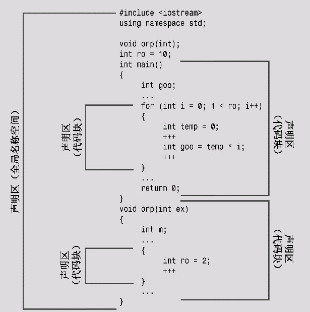
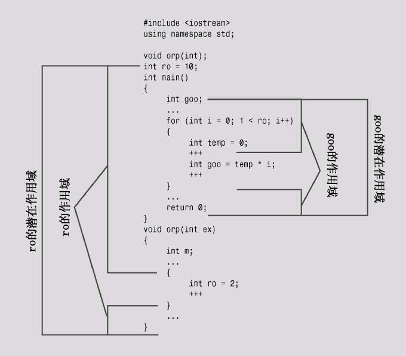

# 9.3 namespace

主要目的是,区分两个库中的相同的类

## 1.传统的C++名称空间

声明区域(declaration region)是可以在其中进行声明的区域

>   比如可以在函数外声明全局变量
>
>   比如可以在函数内声明局部变量(声明区域在代码块`{}`中)

潜在作用域(potential scope)

>   从声明点开始,到声明区域的结尾,必须在变量定义后才能使用

作用域(scope)

>   变量实际的作用区域(比如在代码块中,会覆盖全局变量)





## 2.新的名称空间特性

可以通过声明一种新的命名区域来创建命名的名称空间

```cpp
namespace Jack{
    double pail;
    void fetch();
    int pal;
    struct Well{};
}
namespace Jill{
    double pail;
    void fetch();
    int pal;
    struct Well{};
}
```

**1.名称空间:可以是全局的,可以位于另一个名称空间中,但不能在代码块中**

>   默认情况下,名称空间中声明的名称的链接性为外部(全局可用)
>
>   当然也可以添加新的/补充的定义到已有的名称列表中
>
>   ```cpp
>   namespace Jill{
>       char * goose(const char *)
>   }
>   namespace Jack{
>       void fetch()
>       {
>           ...;
>       }
>   }
>   ```

**2.访问的方式通过`域解析运算符::`进行限定**

>   ```cpp
>   Jack::pail = 12.34;		// use a variable
>   Jill::Hill mole;		// create a structure
>   Jack::fetch();			// use a function
>   ```
>
>   **当然可用使用`using`编译指令**
>
>   ```cpp
>   using namespace Jill; 	// 一般不这么用,会全局替换
>   using Jill::fetch;		// 在代码块中的fetch统一化
>   
>   // 注意最好不要使用两次using(编译器也不会允许)
>   using Jill::pal; 	
>   using Jack::pal; 	
>   pal = 4; // which one???
>   ```

**<font color=red>3.using编译指令/全部变量/local变量</font>**

```cpp
namespace Jill{
	double bucket(double n){}
    double fetch;
    struct Hill{};
}
char fetch;	// global namespace
int main()
{
    using namespace Jill; // import all namespace
    Hill Thrill;
    double water = bucket(2);
    double fetch;
    cin >> fetch;		// read local fetch	
    cin >> ::fetch; 	// read global fetch
    cin >> Jill::fetch; // read Jill::fetch
}
int func()
{
	Hill top;			// ERROR,不在作用域
    Jil::Hill crest;
}
```

>   通过`::`运算符跳出当前作用域,到达全局作用域,是唯一的方式(编译方法)
>
>   通过`&`运算符是允许一个函数通过地址操作另一个作用域的数据(运行方法)

**4.名称空间的其它特性**

>   名称空间是可嵌套的
>
>   ```cpp
>   namespace elements
>   {
>   	namespace fire
>       {
>           int flame;
>       }
>       float water;
>   }
>   // 访问flame变成 element::fire::flame
>   // 或者using namespace elements::fire;
>   ```
>
>   名称空间中使用`using`编译指令和`using`声明
>
>   ```cpp
>   namespace myth
>   {
>   	using Jill::fetch;
>       using namespace elements;
>       using std::out;
>       using std::cin;
>   }
>   // std::cin >> myth::fetch
>   // 表示使用std中的cin方法来赋值myth中的Jil::fetch变量
>   // std::cin >> Jill::fetch
>   // 这两个等价的
>   ```
>
>   名称空间可以创建别名,使用`namespace`关键字
>
>   ```cpp
>   namespace my_very_favorite_things{...};
>   namespace mvft = my_very_favorite_things;
>   // 可以简化缩写
>   namespace MEF = myth::elements::fire;
>   using MEF::flame; // myth::elements::fire::flame
>   ```

**5.未命名的名称空间**

>   可以通过省略名称空间的名称来创建未命名的名称空间
>
>   ```cpp
>   namespace
>   {
>       int ice;
>       int bandycoot;
>   }
>   ```
>
>   **但是这里的链接性就变成内部了,其它文件不能使用该namespace中的名称**
>
>   >   因为链接性变成内部了,所以可以替代`static`声明变量了
>
>   ```cpp
>   // 两种等价写法
>   static int counts;
>   namespace
>   {
>   	int counts;
>   }
>   ```

## 3.名称空间实例

```cpp
// 9.11 namesp.h
#include<string>
namespace pers
{
	struct Person
    {
      	std::string fname;
        std::string lname;
    };
    void getPerson(Person &);
    void showPerson(const Person &);
}
namespace debts
{
	using namespace pers; // 嵌套
    struct Debt
    {
      	Person name;
        double amount;
    };
    void getDebt(Debt &);
    void showDebt(const Debt &);
    double sumDebts(const Debt ar[],int n);
}
```

```cpp
// 9.12 namesp.cpp(源代码文件)
#include<iostream>
#include"namesp.h"
namespace pers
{
	using std::cout;
    using std::cin;
    void getPerson(Person &rp)
    {
        cout << "Enter first name";
        cin >> rp.fname;
        cout << "Enter last name";
        cin >> rp.lname;
    }
    void showPerson(const Person &rp)
    {
        std::cout << rp.lname << "," << rp.fname;
    }
}
namespace debts
{
	void getDebt(Debt & rd)
    {
		getPerson(rd.name);
        std::cout << "Enter Debt";
        std::cin >> rd.amount;
    }
    void showDebt(const Debt &rd)
    {
        showPerson(rd.name);
        std::cout << ":$" << rd.amount << std::endl;
    }
    double sumDebts(const Debt ar[],int n)
    {
        double total = 0;
        for(int i = 0;i < n;i++)
            total += ar[i].amount;
        return total;
    }
}
```

```cpp
// 9.13 namessp.cpp(使用using namespace)
#include<iostream>
#include"namesp.h"
void other(void);
void another(void);
int main(void)
{
    using debts::Debt;
    using debts::showDebt;
    Debt golf = {{"Benny","Goatsniff"},120.0};
    showDebt(golf);
    other();
    another();
    return 0;
}
void other(void)
{
	using std::cout;
    using std::endl;
    using namespace debts;
    Person dg = {"Doodles","Glister"};
    showPerson(dg);
    cout << endl;
    Debt zippy[3];
    int i;
    for(i = 0;i < 3;i++)
        getDebt(zippy[i]);
    for(i = 0;i < 3;i++)
        showDebt(zippy[i]);
    cout << sumDebts(zippy,3) << endl;
    return;
}
void another(void)
{
    using pers::Person;
    Person collector = {"Milo","Rightshift"};
    pers::showPerson(collector);
    std::cout << std::endl;
}
```

## 4.名称空间及其前途

使用在已命名的名称空间中声明的变量，而不是使用外部全局变量。
使用在已命名的名称空间中声明的变量，而不是使用静态全局变量。

如果开发了一个函数库或类库，将其放在一个名称空间中。事实上，C++当前提倡将标准函数库放在名称空间std中，这种做法扩展到了来自C语言中的函数。

>   例如，头文件math.h是与C语言兼容的，没有使用名称空间，但C++头文件cmath应将各种数学库函数放在名称空间std中。实际上，并非所有的编译器都完成了这种过渡。

仅将编译指令using作为一种将旧代码转换为使用名称空间的权宜之计。
**不要在头文件中使用using编译指令。**

>   首先，这样做掩盖了要让哪些名称可用；另外，包含头文件的顺序可能影响程序的行为。如果非要使用编译指令using，应将其放在所有预处理器编译指令`#include`之后。

导入名称时，首选使用作用域解析运算符或using声明的方法。

对于using声明，首选将其作用域设置为局部而不是全局。