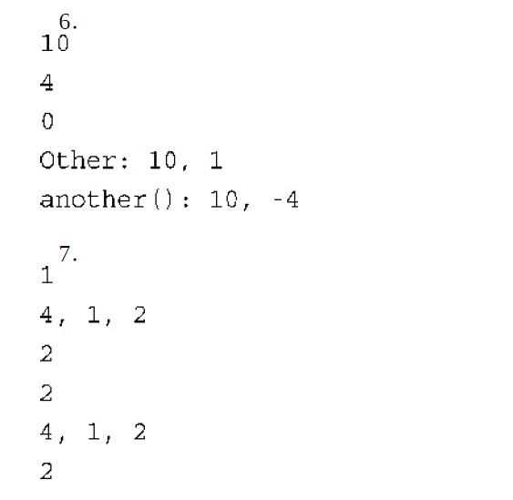

# 9.4 Homework

## 总结

C++鼓励程序员在开发程序时使用多个文件。一种有效的组织策略:

>   使用头文件来定义用户类型，为操纵用户类型的函数提供函数原型；
>
>   并将函数定义放在一个独立的源代码文件中。
>
>   头文件和源代码文件一起定义和实现了用户定义的类型及其使用方式。
>
>   最后，将main( )和其他使用这些函数的函数放在第三个文件中。

C++的存储方案决定了变量保留在内存中的时间（储存持续性）以及程序的哪一部分可以访问它（作用域和链接性）。

>   自动变量是在代码块（如函数体或函数体中的代码块）中定义的变量，仅当程序执行到包含定义的代码块时，它们才存在，并且可见。自动变量可以通过使用存储类型说明符register或根本不使用说明符来声明，没有使用说明符时，变量将默认为自动的。register说明符提示编译器，该变量的使用频率很高，但C++11摒弃了这种用法。
>
>   静态变量在整个程序执行期间都存在。对于在函数外面定义的变
>   量，其所属文件中位于该变量的定义后面的所有函数都可以使用它（文
>   件作用域），并可在程序的其他文件中使用（外部链接性）。**另一个文**
>   **件要使用这种变量，必须使用extern关键字来声明它。**对于文件间共享
>   的变量，应在一个文件中包含其定义声明（无需使用extern，但如果同
>   时进行初始化，也可使用它），并在其他文件中包含引用声明（使用
>   extern且不初始化）。**在函数的外面使用关键字static定义的变量的作用**
>   **域为整个文件，但是不能用于其他文件（内部链接性）**。在代码块中使
>   用关键字static定义的变量被限制在该代码块内（局部作用域、无链接
>   性），但在整个程序执行期间，它都一直存在并且保持原值。
>
>   在默认情况下，C++函数的链接性为外部，因此可在文件间共享；但使用关键字static限定的函数的链接性为内部的，被限制在定义它的文件中。

动态内存分配和释放是使用new和delete进行的，它使用自由存储区
或堆来存储数据。调用new占用内存，而调用delete释放内存。程序使用
指针来跟踪这些内存单元。

名称空间允许定义一个可在其中声明标识符的命名区域。这样做的
目的是减少名称冲突，尤其当程序非常大，并使用多个厂商的代码时。
可以通过使用作用域解析运算符、using声明或using编译指令，来使名
称空间中的标识符可用。

## 复习题

1．对于下面的情况，应使用哪种存储方案？

>   a．`homer`是函数的形参。:**自动**
>
>   b．`secret`变量由两个文件共享。:**外部变量+extern**
>
>   c．`topsecret`变量由一个文件中的所有函数共享，但对于其他文件来说是隐藏的。:**static**
>
>   d．`beencalled`记录包含它的函数被调用的次数:**static**

2．using声明和using编译指令之间有何区别？

>using声明使得名称空间中的**单个名称可用**，其作用域与using所在的声明区域相同。
>
>using编译指令使名称空间中的**所有名称可用**。使用using编译指令时，就像在一个包含using声明和名称空间本身的最小声明区域中声明了这些名称一样

3．重新编写下面的代码，使其不使用using声明和using编译指令。

```cpp
#include<iostream>
using namespace std;
int main()
{
    double x;
    cout <<  "Enter value";
    while(!(cin >> x))
    {
        cout << "Bad input";
        cin.clear();
        while(cin.get() != '\n')
            continue;
    }
    cout << "Value = " << x << endl;
    return 0;
}
```

>```cpp
>#include<iostream>
>int main()
>{
>    double x;
>    std::cout <<  "Enter value";
>    while(!(cin >> x))
>    {
>        std::cout << "Bad input";
>        std::cin.clear();
>        while(std::cin.get() != '\n')
>            continue;
>    }
>    std::cout << "Value = " << x << std::endl;
>    return 0;
>}
>```

4．重新编写下面的代码，使之使用using声明，而不是using编译指令。

```cpp
#include<iostream>
using namespace std;
int main()
{
    double x;
    cout << "Enter value";
    while(!(cin >> x))
    {
        cout << "Bad";
        cin.clear();
        while(cin.get() != '\n')
            continue;
    }
    cout << x << endl;
    return 0;
}
```

>```cpp
>#include<iostream>
>int main()
>{	
>    using std::cin;
>    using std::cout;
>    using std::endl;
>    double x;
>    cout << "Enter value";
>    while(!(cin >> x))
>    {
>        cout << "Bad";
>        cin.clear();
>        while(cin.get() != '\n')
>            continue;
>    }
>    cout << x << endl;
>    return 0;
>}
>```

5．在一个文件中调用average(3, 6)函数时，它返回两个int参数的int
平均值，在同一个程序的另一个文件中调用时，它返回两个int参数的
double平均值。应如何实现？

>可以在每个文件中包含单独的静态函数定义。或者每个文件都在未命名的名称空间中定义一个合适的average( )函数。

6．下面的程序由两个文件组成，该程序显示什么内容？

```cpp
// file1.cpp
#include<iostream>
using namespace std;
void other();
void another();
int x = 10;
int y;
int main()
{
    cout << x << endl;
    {
        int x = 4;
        cout << x << endl;
        cout << y << endl;
    }
    other();
    another();
    return 0;
}
void other()
{
    int y = 1;
    cout << x << " "<< y << endl;
}
// file2.cpp
#include<iostream>
using namespace std;
extern int x;
namespace 
{
    int y = -4;
}
void another()
{
    cout << x << " " << y << endl;
}
```

7．下面的代码将显示什么内容？

```cpp
#include<iostream>
using namespace std;
void other();
namespace n1
{
    int x = 1;
}
namespace n2
{
    int x = 2;
}
int main()
{
    using namespace std;
    cout << x << endl;
    {
        int x = 4;
        cout << x << " " << n1::x << " " << n2::x << endl;
    }
    using n2::x;
    cout << x << endl;
    other();
    return 0;
}
void other()
{
    using namespace n2;
    cout << x << endl;
    {
        int x = 4;
        cout << x << " " << n1::x << " " << n2::x << endl;
    }
    using n2::x;
    cout << x << endl;
}
```

