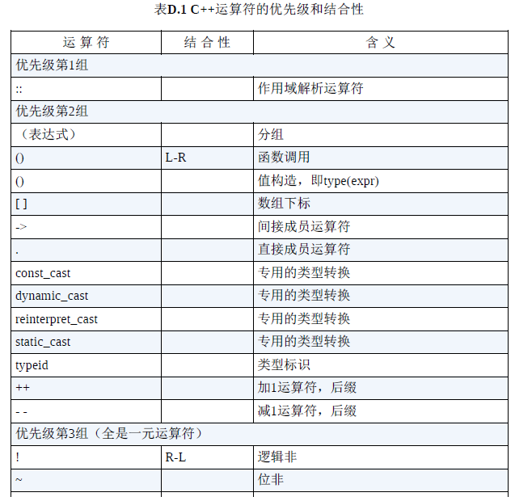
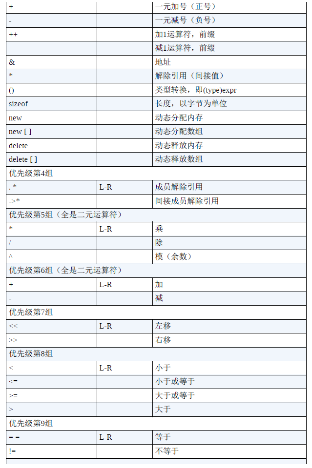
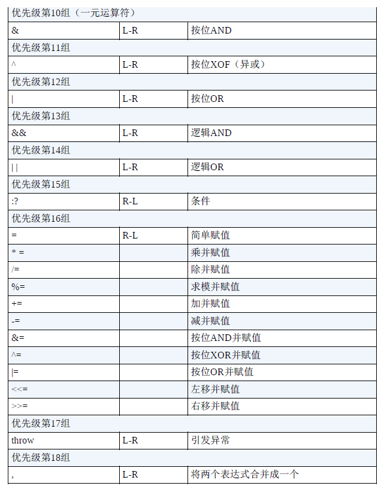

# Chap3 Solve Data

P103~P166

## 本章内容

1.C++变量的命名规则。

2.C++内置的整型——unsigned long、long、unsigned int、int、
unsigned short、short、char、unsigned char、signed char和bool。

3.C++11新增的整型：unsigned long long和long long。

4.表示各种整型的系统限制的climits文件。

5.各种整型的数字字面值（常量）。

6.使用const限定符来创建符号常量。

7.C++内置的浮点类型：float、double和long double。

8.表示各种浮点类型的系统限制的cfloat文件。

9.各种浮点类型的数字字面值。

10.C++的算术运算符。

11.自动类型转换。

12.强制类型转换。

## 1.简单变量

**1.变量名要求**

1.在名称中只能使用字母字符or数字or下划线

<font color=red>2.名称的第一个字符不能是数字</font>

<font color=red>3.严格区分大小写</font>

4.不能将关键字作为名词

(大写字母和下划线开头的保留给编译器使用)

****

**2.整型**

整型就是没有小数部分的数字,不同的C++整型使用不同的内存量

****

**3.`short` \ `int` \ `long` \ `long long`**  

`short`:至少16位(等价于`short int`)

`int`:至少和`short`一样长:

`long`:至少和`int`一样长,至少有32位(等价于`long int`)

`long long`:至少和`long`一样长,至少有64位(等价于`long long int`)

可以通过C++工具检查类型的长度:`sizeof`工具/头文件`climits`(限制位数)

```cpp
// 3.1 limits.cpp
#include<iostream>
#include<climits>
int main()
{
    using namespace std;
    int n_int = INT_MAX;	// 使用内置的INT_MAX限制int长度
    short n_short = SHRT_MAX	//使用内置的SHRT_MAX限制short长度
    long n_long = LONG_MAX  // 使用内置的LONG_MAX限制long长度
    long long n_llong = LLONG_MAX // long long限制
    
    // sizeof语法:对于类型名放入括号,对于变量名可选    
    // sizeof(int)正确,sizeof(n_short)和sizeof n_short都对
        
    cout << n_int << n_short << n_long << n_llong; //显示大小限制
    cout << sizeof(n_int) << sizeof(n_short); //显示字节大小限制
    
}
```

>   **1.`sizeof()`语法和`climits`**
>
>   >   语法部分在注释中有解释,对于类型名和变量名的限制不同
>
>   >climits中还有其它的符号常量:
>   >
>   >CHAR_BIT char的位数
>   >CHAR_MAX char的最大值
>   >CHAR_MIN char的最小值
>   >SCHAR_MAX signed char的最大值
>   >SCHAR_MIN signed char的最小值
>   >UCHAR_MAX unsigned char的最大值
>   >SHRT_MAX short的最大值
>   >SHRT_MIN short的最小值
>   >USHRT_MAX unsigned short的最大值
>   >INT_MAX int的最大值
>   >INT_MIN int的最小值
>   >UNIT_MAX unsigned int的最大值                          LONG_MAX long的最大值
>   >LONG_MIN long的最小值
>   >ULONG_MAX unsigned long的最大值
>   >LLONG_MAX long long的最大值
>   >LLONG_MIN long long的最小值
>   >ULLONG_MAX unsigned long long的最大值
>
>   >   预处理编译指令`#define`:数值替换指令
>
>   **2.C++变量初始化(再)**
>
>   >   C的初始化方式:`int number = 123;`
>   >
>   >   C++初始化方式1:`int number(123);`
>   >
>   >   如果不对函数内部定义的变量进行初始化,**该变量的值是内存单元的值**
>   >
>   >   最好不要先声明变量再赋值,而是直接初始化
>   >
>   >   C++初始化方式2:`int number{123}`or`int number = {123}`
>   >
>   >   如果设置`int number = {}`,则默认赋值为0

****

**4.无符号类型`unsigned`**

无符号类型不能存储负数值的无符号变体

>   如果`short`表示:-32768到+32767
>
>   则`unsigned short`表示:0到65535`(|-32768|+|32767| = 65535)`
>
>   ```cpp
>   // 3.2 exceed.cpp
>   #include<iostream>
>   #define ZERO 0
>   #include<climits>
>   int main()
>   {
>       using namespace std;
>       short sam = SHRT_MAX;
>       unsigned short sue = sam; //初始化
>       cout << "Sam has" << sam << "dollars" << endl;
>       cout << "Sue has" << sue << "dollars" << endl;
>       
>       sam = sam + 1;
>       sue = sue + 1;
>       cout << "Sam has" << sam << "dollars" << endl;
>       cout << "Sue has" << sue << "dollars" << endl;
>       
>       sam = ZERO;
>       sue = ZERO;
>       cout << "Sam has" << sam << "dollars" << endl;
>       cout << "Sue has" << sue << "dollars" << endl;
>       
>       sam = sam - 1;
>       sue = sue - 1;
>       cout << "Sam has" << sam << "dollars" << endl;
>       cout << "Sue has" << sue << "dollars" << endl;
>       
>       return 0;
>   }
>   ```
>
>   **+1:`short`:32767 to -32768 `unsigned short`:32767->32768**
>
>   **设0后-1:`short`:0 to -1 `unsigned short`:0 to 65535**

****

**5.选择整型类型**

1.根据系统选择:16位的系统上最好不要用32位的

2.根据大小选择:如果存储的值超过20亿,可以使用`long long`

3.根据需求选择:如果需要节选内存(大型数组中),可以使用`short`

4.特殊要求:如果只需要一个字节,可以使用`char`

****

**6.整型字面值**

C++能用三种不同的计数方式书写整数:十进制/八进制/十六进制

>   十进制转八进制:十进制数除以8直到商为0,然后将余数倒序排列
>
>   十进制转十六进制:十进制数除以8直到商为0,然后将余数倒序排列
>
>   (对于10到15的余数使用A-F表示)

>   八进制转十进制:倒序按位,每一位乘以对应的8的幂次方,然后相加
>
>   八进制转十六进制:倒序按位,每一位乘以对应的16的幂次方,然后相加

```cpp
// 3.3 hexoct.cpp
#include<iostream>
#include<iomanip>
int main()
{
    using namespace std;
    int chest = 42;   // 10进制
    int waist = 0x42; // 16进制
    int inseam = 042; // 8进制
    // 注意在这里的时候就已经完成了十进制的转化了
    
    // cout默认是按照十进制进行输出的
    cout << chest << endl; // 42
    cout << waist << endl; // 66
    cout << inseam << endl; //34
    // 除非使用类和结构体保留原值
    /*
		enum class Base { DEC = 10, OCT = 8, HEX = 16 };
		struct NumberWithBase {
    		int value;     
    		Base original_base; 
		};
		 NumberWithBase chest  = {42,  Base::DEC}; 
    	 NumberWithBase waist  = {0x42, Base::HEX}; 
   	 	 NumberWithBase inseam = {042,  Base::OCT}; 
    */
}
```

****

**7.C++如何确定常量类型**

C++对于整数的寸尺方式默认为int(除非有特殊后缀/值太大)

>特殊后缀:`22022L`:`long`(32位) `2202LU`:`unsigned long`(32位)
>
>大小: `int` -> `unsigned int long` -> `unsigned long` -> `long long`
>
>特殊进制:十六进制数`0x9C40`被转化为十进制`40000`所以使用`unsigned int`

****

**8.char类型:字符和小整数**

最常用的是ASCII码,除此之外还可以使用宽字符存储Unicode字符集(`wchar_t`)

char的大小是1个字节(8位,2^8^=256)

```cpp
// 3.5 chartype.cpp
#include<iostream>
int main()
{
	using namespace std;
    char ch;
    cin >> ch;
    cout << ch << endl;
    return 0;
}
```

**这里注意输出的是`ASCII码`对于的具体字符,而不是`ASCII码`**

**因为是`cin`将输入的字符转化为数值,`cout`将值转化为显示的字符**

>   这里又涉及到`<<`的重载,遇到`char`的时候会去找对应的字符

**C++中`char`使用 `''`表示,string使用`""`表示(两者有天壤之别)**

```cpp
// 3.6 morechar.cpp
// 由此可见cin和cout的联动会直接输出字符,需要额外的变量存ASCII码
#include<iostream>
int main()
{
    using namespace std;
    char ch = 'M'; // 这里存的其实是ASCII码
    // 'M' = 77 = 01001101
    int i = ch;
    cout << ch << "的ASCII码是" << i << endl;
	//一样的输出内容
	cout.put(ch);
	cout << "的ASCII码是" << i << endl;
    return 0;
}
```

**`char`和`int`的细微差距(虽然输出都是一样的)**

>当`char ch;cin >> ch;`时:即使输入数字,ch也会存储对应的ASCII码
>
>当`int ch;cin >> ch;`时:即使输入数字,ch会转化为数字,然后输出

****

**9.成员函数`cout.put()`**

```cpp
// 3.6 morechar.cpp
#include<iostream>
{
    char ch = 'M';
    cout.put(ch);
    cout.put('!')
    // 输出M!
    return 0;
}
```

`cout.put()`是成员函数(归于类所有,类定义了如何表示和控制数据)

>   类`ostream`中有一个`put()`成员函数用于输出字符
>
>   只能通过特定对象`cout`进行调用,`.`称为成员运算符

## 3.char字面值

**1.char的ASCII码**

书写字符常量字符的时候将字符号括起,比如'5',避免混淆

****

**2.char的转义编码**

|  字符名称  | C++代码 |
| :--------: | :-----: |
|   换行符   |   \n    |
| 水平制表符 |   \t    |
| 垂直制表符 |   \v    |
|    退格    |   \b    |
|    回车    |   \r    |
|   反斜杠   |    \    |
|    问号    |   \?    |
|   单引号   |   \\'   |
|   双引号   |   \\"   |

```cpp
//3.7 bondni.cpp
#include<iostream>
int main()
{
    using namespace std;
    cout << "\aOperation \"HyperHyper\" is now activated!\n";
    cout << "Enter your agent code:________\b\b\b\b\b\b\b\b";
    long code;
    cin >> code;
    cout << "\aYou entered " << code << "...\n";
    cout << "\aCode verified! Proceed with Plan 23! \n";
    return 0;
}
```

## 4.通用字符名

**(仅了解):可以通过`\u`来实现Unicode拓展字符(比如法语重音符号)**

## 5.`signed char`和`unsigned char`

char在默认情况下,**既不是有符号的,也不是没符号的(由C++决定)**,可自定义

```cpp
char fodo; // 可能signed,可能unsigned
unsigned char bar; // unsigned
signed char shark; // signed
```

**如果将char作为数值类型**

>   `unsigned char`:`0~255`
>
>   `signed char`:`-128~127`

## 6.wchar_t长字节

**出现目的:当需要处理的字符集无法用一个8位的字节表示(日语)**

>   解决方法1:如果是基本字符集->将char定义为一个16位的字节
>
>   解决方法2:使用`wchar_t`创建更多空间表示拓展字符集

**`wchar_t`不适用于`cin/cout`输入输出流,而是`wcin/wcout`**

`wchar_t`作为长字节支持两字节/四字节,但是一般不使用,仅做了解

```cpp
#include <iostream> 
#include <string>   
#include <locale>   

int main() {
    // 1. 定义一个宽字符串字面量
    // 注意 L 前缀，这表示 "こんにちは" 是由 wchar_t 字符组成的数组。
    const wchar_t* hello_japanese = L"こんにちは、世界！"; // Konnichiwa, Sekai! (Hello, World!)

    // 2. 使用宽字符串类 std::wstring
    std::wstring message = L"これはワイド文字列です。"; 

    // 3. 使用 std::wcout 进行输出
    std::wcout << hello_japanese << std::endl;
    std::wcout << message << std::endl;
    
    // wchar_t 在当前系统上的大小为4
    std::wcout << sizeof(wchar_t) << L" bytes." << std::endl;
    return 0;
}
```

## 7.char16_t和char32_t(C++11)

**为了处理Unicode和`wchar_t`都不够的情况,两个都是无符号的**

## 8.const限定符

`const type name = value;`会将该变量的值进行锁定,无法修改

<font color=red>**所以`const`一定要限定value,否则锁定为未知值时无法修改**</font>

**`const`和`#define`**

>   `#define`是无脑的文本替换,`const`是有类型受作用域限制的变量
>
>   好处1:`const`定义的变量编译器可以查找出错误
>
>   ```cpp
>   const float ASPECT_RATIO = 1.777f;
>   char* ratio = ASPECT_RATIO; // 编译器会直接报错：
>   // error: cannot convert 'float' to 'char*' in initialization
>   ```
>
>   好处2:同时如果头文件含有同名的`#define`定义可能会被覆盖
>
>   好处3:明确指定类型并作用域更复杂的类型(比如数组和结构)

## 9.浮点数

**在C++中,浮点数被存储为`基准值`+`缩放因子(小数点移动的位置)`**

**1.书写浮点数**

1.标准小数点表示法:`12.34`,`0.00023`

2.E表示法(不能有空格):

>   `3.45E6`(表示`3.45`和`1000000`相乘的结果)
>
>   `8.33E~4`(表示`8.33`和`10000`相除的结果)
>
>   `2.52e+9`(表示`2.52`小数点向右移动`9`位)
>
>   `9.11e-31`(表示`9.11`小数点向左移动`31`位)
>
>   (即可以用E也可以用e)

****

**2.浮点数类型`float`/`double`/`long double`**

`float`至少32位;`double`至少48位;`long double`一般为128位

>   同时指数范围至少是`-37`到`37`

```cpp
//3.8 floatnum.coo
#include<iostream>
int main()
{
    using namespace std;
    cout.setf(ios_base::fixed,ios_base::floatfield); // 常量
    float tub = 10.0 / 3.0  ; // 一般输出6位
    double mint = 10.0 / 3.0 ;// 一般输出15位
    const float million = 1.0e6;
    
    cout << "tub = " << tub;
    cout << " , a million tub = " << million * tub;
    cout << ".\nand ten million tubs = ";
    cout << 10 * million * tub << endl;
    
    cout << "mint = " << mint << " and a million mints";
    cout << million * mint <<endl;
    return 0;
}
// tub = 3.333333 , a million tub = 3333333.250000.
// and ten million tubs = 33333332.000000
// mint = 3.333333 and a million mints3333333.333333
```

>   **1.`cout.setf()`的作用是避免`cout`删除结尾的0**
>
>   **2.通过大数乘法可以看出来浮点数产生的结果不准确**

****

**3.浮点常量**

默认为`double`,可通过f或F后缀转化为`float`,可通过l或L转为`long double`

```cpp
1.234f 		// float
2.45E20F 	// float
2.3453E28 	// double
2.2L 		// long double
```

****

**4.浮点数的优缺点**

优点:1.表示小数 2.表示的范围大得多

缺点:1.计算速度慢 2.精度降低(**注意`float`只能保证6位有效位**)

```cpp
// fltadd.cpp
#include<iostream>
int main()
{
    using namespace std;
    float a = 2.34E+22f;
    float b = a + 1.0f;
    cout << b - a << endl; // 应该输出1.0,但是实际输出0
    return 0;
}
```

## 10.C++算术运算符

**额外注意`%`求模符号只能用于两个整型**

```cpp
#include<iostream>
int main()
{
    using namespace std;
    float a,b;
    cout.setf(ios_base::fixed,ios_base::floatfield); // 常量
    cin >> a >> b;
    cout << a + b << endl;
    cout << a - b << endl;
    cout << a * b << endl;
    cout << a / b << endl;
    return 0;
}
```

**1.运算符优先级和结合性**

数值运算遵守数学运算规则,同级别的优先级和结合性相同

>
>
>
>
>

**2.除法分支**

除法行为取决于操作数的类型

>如果两个操作数都是整数,则两个操作数都做整数除法
>
>如果一个或两个操作数是浮点数,则两个操作数做浮点数除法
>
>```cpp
>// 3.11 divide.cpp
>#include<iostream>
>int main()
>{
>    using namespace std;
>    cout.setf(ios_base::fixed,ios_base::floatfield); // 常量
>    cout << 9/5 << endl;     // 1 (int)
>    cout << 9.0/5.0 << endl; // 1.800000  (double)
>    cout << 9.0/5 << endl;   // 1.800000  (double)
>    cout << 9L/5L << endl;   // 1 (long int)
>    cout << 1e7/9.0 << endl;   // 1111111.111111(double)
>    cout << 1e7f/9.0f << endl; // 1111111.125000(float)
> 	
>    return 0;
>
>```

**3.求模运算符**

>   ```cpp
>   // 3.12 modulus.cpp
>   #include<iostream>
>   int main()
>   {
>       using namespace std;
>       const int lbs_per_stn = 14;
>       int lbs;
>       cout << "Enter your weight in pounds ";
>       cin >> lbs;
>       int stone = lbs / lbs_per_stn;
>       int pounds = lbs % lbs_per_stn;
>       cout << stone << pounds;
>       return 0;
>   }
>   ```
>
>   注意即使输入的是小数`cin`也会进行截断从而输出整数的答案
>
>   **如果需要对浮点数求余计算,需要使用`cmath`中的`fmod()`函数**

## 11.类型转换

**1.类型转换的类型**

1.将算术类型的值赋给另一种算术类型的变量(类型不同)

2.表达式中包含不同的函数

3.将参数传递给函数

****

**2.类型转换的问题**

有问题的都是大转小,会导致被截断(浮点到int)甚至结果不确定(double到float)

```cpp
// 3.13 assign.cop
#include<iostream>
int main()
{
    using namespace std;
    cout.setf(ios_base::fixed,ios_base::floatfield); // 常量
    float tree = 3;
    int guess(3.9832);
    int debt = 7.2E12;
    cout << tree << endl;  // 3.000000
    cout << guess << endl; // 3
    cout << debt << endl;  // 2147483647(出错!!)
    return 0;
}
/*
main.cpp: In function ‘int main()’:
main.cpp:9:16: warning: overflow in conversion from ‘double’ to ‘int’ changes value from ‘7.2e+12’ to ‘2147483647’ [-Woverflow]
    9 |     int debt = 7.2E12;
      |                ^~~~~~
*/
```

****

**3.使用`{}`的方式进行的转换(C++11)**

常用于复杂的数据类型提供值列表,在这里窄化转化会直接报错而不是警告

```cpp
const int code = 66;
int x = 66;
char c1 {31325}; // 不合法(char只能从-128到127)
char c2 = {66};  // 合法
char c3 = {code};// 合法(已经知道code的值为66)
char c4 = {x};   // 不合法(x不是const,所以可能会超出char的范围)
x = 31325;
char c5 = x;     //合法
```

****

**4.表达式中的自动转化**

1.在出现的时候就进行类型转换;2.在出现在表达式的时候就进行转化

**整型提升:**

比如将`bool`/`char`/`unsigned char`/`signed char`/`short int` 到`int`

比如将`wchar_t`转换为`int`/`unsigned int`/`unsigned long`

**如果操作数有更高的类型,则优先转换到更高的类型(其中`bool`最低)**

****

**5.传递参数的转换和强制类型转换**

传递参数的类型转换由函数原型(prototype)控制,如果取消原型的控制

则C++会将`float`参数提升到`double`

强制类型转换是一种显式类型转换:`(typename)variety`或`typename(variety)`

**强制类型转换不会修改变量本身,而是创建一个新的+指定类型的值**

强制类型转换中的`static cast<typename> variety`执行严格的转换

```cpp
//3.14 typecast.cpp
#include<iostream>
int main()
{
    using namespace std;
	int auks,bats,coots;
    auks = 19.99 + 11.99;
    bats = (int)19.99 + 11.99;
    coots = int(19.99) + int (11.99);
    cout << auks << endl;   // 31
    cout << bats << endl;   // 30
    cout << coots << endl;  // 30
    
    char ch = 'Z';
    cout << int(ch) << endl;				//90
    cout << static_cast<int>(ch) << endl;	//90
     
    return 0;
}
```

****

**6.C++11中的`auto`声明**

`auto`声明让编译器自行推断变量的类型(初始值决定变量生死)

```cpp
auto n = 10.0    // int
auto x = 1.5     // double
auto y = 1.3e12L // long double
    
auto x // 不合法
auto x = {0}; 		
// C++11:x 的类型是 std::initializer_list<int>
// C++17:x 的类型是int(列表初始化为单个元素)
auto y = {1, 2, 3}; 
// C++11:y 的类型是 std::initializer_list<int>
// C++11:fail
auto z = {"hello"}; // z 的类型是 std::initializer_list<const char*>


// 一般在STL中用auto
std::vector<double>scores;
std::vector<double>::iterator pv = score.begin();
//->
std::vector<double>scores;
auto pv = score.begin();
```

## 12.总结

C++的基本类型分为两组：一组由存储为整数的值组成，另一组由存储为浮点格式的值组成。

整型之间通过存储值时使用的内存量及有无符号来区分。整型从最小到最大依次是：bool、char、signed char、unsigned char、short、unsigned short、int、unsigned int、long、unsigned long 以及C++11新增的long long和unsigned long long。

还有一种wchar_t类型，它在这个序列中的位置取决于实现。C++11新增了类型char16_t和char32_t，它们的宽度足以分别存储16和32位的字符编码。C++确保
了char足够大，能够存储系统基本字符集中的任何成员，而wchar_t则可
以存储系统扩展字符集中的任意成员，short至少为16位，而int至少与
short一样长，long至少为32位，且至少和int一样长。确切的长度取决于实现。

字符通过其数值编码来表示。I/O系统决定了编码是被解释为字符还是数字。

浮点类型可以表示小数值以及比整型能够表示的值大得多的值。3种浮点类型分别是float、double和long double。C++确保float不比double长，而double不比long double长。通常，float使用32位内存，double使用64位，long double使用80到128位。通过提供各种长度不同、有符号或无符号的类型，C++使程序员能
够根据特定的数据要求选择合适的类型。

C++使用运算符来提供对数字类型的算术运算：加、减、乘、除和求模。当两个运算符对同一个操作数进行操作时，C++的优先级和结合性规则可以确定先执行哪种操作。

对变量赋值、在运算中使用不同类型、使用强制类型转换时，C++将把值从一种类型转换为另一种类型。很多类型转换都是“安全的”，即可以在不损失和改变数据的情况下完成转换。例如，可以把int值转换为long值，而不会出现任何问题。对于其他一些转换，如将浮点类型转换为整型，则需要更加小心。
## 13.Homework

1．为什么C++有多种整型？

>   对应不同需求,比如有的需要节省空间(大的二维数组)就用`short`

2．声明与下述描述相符的变量。

>   a．short整数，值为80:`short rbis = 80;`
>
>   b．unsigned int整数，值为42110:`unsigned int q = 42110;`
>
>   c．值为3000000000的整数:`unsigned long num3 = 3e9`

**3．C++提供了什么措施来防止超出整型的范围？**

>C++没有提供自动防止超出整型限制的功能，可以使用头文件climits来确定限制情况

4．33L与33之间有什么区别？

>   一个是`long`,一个是`int`

5．下面两条C++语句是否等价`char grade = 65;int grade = 'A';`？

>   只是输出相同,但是后者是读取ASCII码得到的

6．如何使用C++来找出编码88表示的字符？指出至少两种方法。

>   `cout.put(char(88));`
>
>   `cout<<char(88)<<endl;`
>
>   `cout<<(char)88<<endl;`
>
>   `char c = 88;cout << c << endl;`

7．将long值赋给float变量会导致舍入误差，将long值赋给double变量呢？将long long值赋给double变量呢？

>   不会产生损失(和字节数有关)`double`只有13位有效(3字节多点)
>
>   然而`long`可以有4字节,`long long`可以有5字节

8．下列C++表达式的结果分别是多少？

```cpp
a.	8*9+1 = 74
b.  6*3/4 = 4
c.	3/4*6 = 0 //左往右运算
d.	6.0*3/4 = 4.5
e.	15%4 = 3
```

9．假设x1和x2是两个double变量，您要将它们作为整数相加，再将结果赋给一个整型变量。请编写一条完成这项任务的C++语句。如果要将它们作为double值相加并转换为int呢？

>`int pos = static_cast<int>(x1)+static_cast<int>(x2);`
>
>`int pos = int(x1)+int(x2);`

>`int result1 = static_cast<int>(x1 + x2);`
>
>`int result2 = int(x1 + x2);`

10．下面每条语句声明的变量都是什么类型？

```cpp
auto cars = 15;     		// int
auto iou = 150.37f;			// float
auto level = 'B';			// char
auto crat = U'/U00002155';	// char32_t
auto fract = 8.25f/2.5;		// double
```

