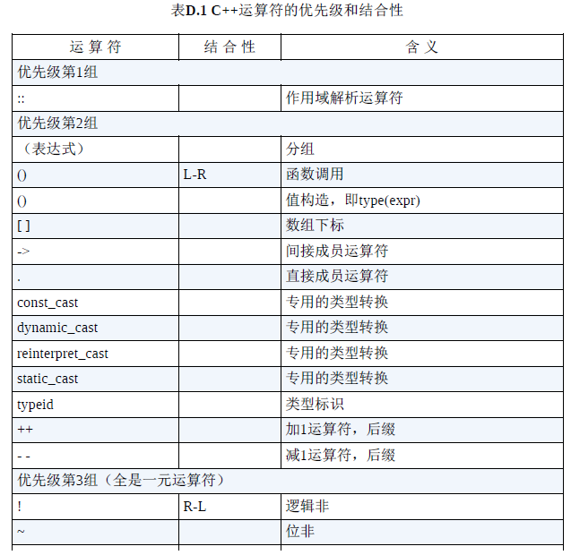
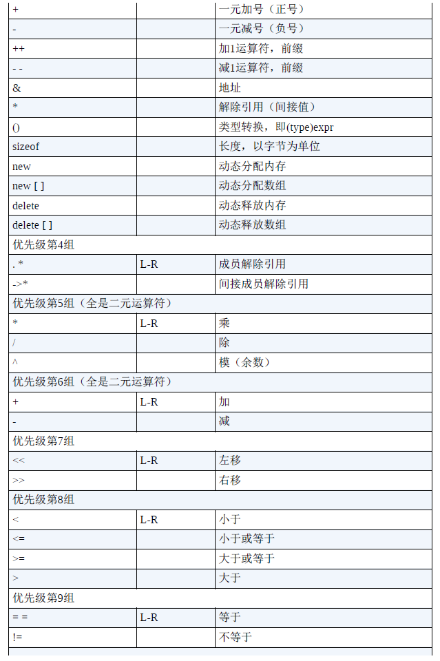
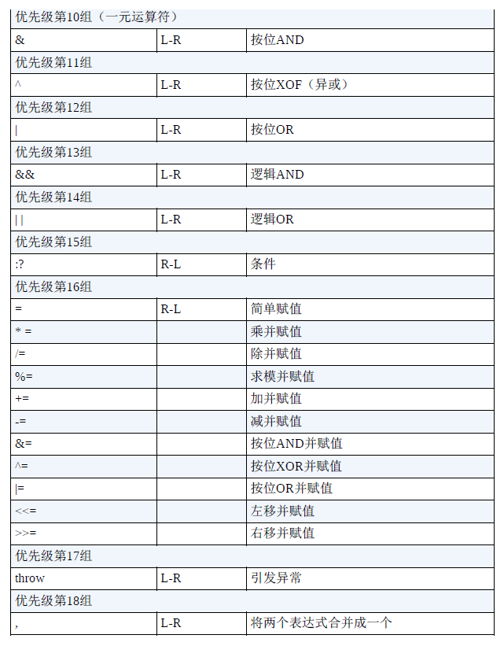

# 3.4 C++的算术运算符

**额外注意`%`求模符号只能用于两个整型**

```cpp
#include<iostream>
int main()
{
    using namespace std;
    float a,b;
    cout.setf(ios_base::fixed,ios_base::floatfield); // 常量
    cin >> a >> b;
    cout << a + b << endl;
    cout << a - b << endl;
    cout << a * b << endl;
    cout << a / b << endl;
    return 0;
}
```

## **1.运算符优先级和结合性**

数值运算遵守数学运算规则,同级别的优先级和结合性相同

>
>
>
>
>

## **2.除法分支**

除法行为取决于操作数的类型

>如果两个操作数都是整数,则两个操作数都做整数除法
>
>如果一个或两个操作数是浮点数,则两个操作数做浮点数除法
>
>```cpp
>// 3.11 divide.cpp
>#include<iostream>
>int main()
>{
>using namespace std;
>cout.setf(ios_base::fixed,ios_base::floatfield); // 常量
>cout << 9/5 << endl;     // 1 (int)
>cout << 9.0/5.0 << endl; // 1.800000  (double)
>cout << 9.0/5 << endl;   // 1.800000  (double)
>cout << 9L/5L << endl;   // 1 (long int)
>cout << 1e7/9.0 << endl;   // 1111111.111111(double)
>cout << 1e7f/9.0f << endl; // 1111111.125000(float)
>
>return 0;
>
>```

## **3.求模运算符**

>   ```cpp
>   // 3.12 modulus.cpp
>   #include<iostream>
>   int main()
>   {
>      using namespace std;
>      const int lbs_per_stn = 14;
>      int lbs;
>      cout << "Enter your weight in pounds ";
>      cin >> lbs;
>      int stone = lbs / lbs_per_stn;
>      int pounds = lbs % lbs_per_stn;
>      cout << stone << pounds;
>      return 0;
>   }
>   ```
>
>   注意即使输入的是小数`cin`也会进行截断从而输出整数的答案
>
>   **如果需要对浮点数求余计算,需要使用`cmath`中的`fmod()`函数**

## 4.类型转换

**1.类型转换的类型**

1.将算术类型的值赋给另一种算术类型的变量(类型不同)

2.表达式中包含不同的函数

3.将参数传递给函数

****

**2.类型转换的问题**

有问题的都是大转小,会导致被截断(浮点到int)甚至结果不确定(double到float)

```cpp
// 3.13 assign.cop
#include<iostream>
int main()
{
    using namespace std;
    cout.setf(ios_base::fixed,ios_base::floatfield); // 常量
    float tree = 3;
    int guess(3.9832);
    int debt = 7.2E12;
    cout << tree << endl;  // 3.000000
    cout << guess << endl; // 3
    cout << debt << endl;  // 2147483647(出错!!)
    return 0;
}
/*
main.cpp: In function ‘int main()’:
main.cpp:9:16: warning: overflow in conversion from ‘double’ to ‘int’ changes value from ‘7.2e+12’ to ‘2147483647’ [-Woverflow]
    9 |     int debt = 7.2E12;
      |                ^~~~~~
*/
```

****

**3.使用`{}`的方式进行的转换(C++11)**

常用于复杂的数据类型提供值列表,在这里窄化转化会直接报错而不是警告

```cpp
const int code = 66;
int x = 66;
char c1 {31325}; // 不合法(char只能从-128到127)
char c2 = {66};  // 合法
char c3 = {code};// 合法(已经知道code的值为66)
char c4 = {x};   // 不合法(x不是const,所以可能会超出char的范围)
x = 31325;
char c5 = x;     //合法
```

****

**4.表达式中的自动转化**

1.在出现的时候就进行类型转换;2.在出现在表达式的时候就进行转化

**整型提升:**

比如将`bool`/`char`/`unsigned char`/`signed char`/`short int` 到`int`

比如将`wchar_t`转换为`int`/`unsigned int`/`unsigned long`

**如果操作数有更高的类型,则优先转换到更高的类型(其中`bool`最低)**

****

**5.传递参数的转换和强制类型转换**

传递参数的类型转换由函数原型(prototype)控制,如果取消原型的控制

则C++会将`float`参数提升到`double`

强制类型转换是一种显式类型转换:`(typename)variety`或`typename(variety)`

**强制类型转换不会修改变量本身,而是创建一个新的+指定类型的值**

强制类型转换中的`static cast<typename> variety`执行严格的转换

```cpp
//3.14 typecast.cpp
#include<iostream>
int main()
{
    using namespace std;
	int auks,bats,coots;
    auks = 19.99 + 11.99;
    bats = (int)19.99 + 11.99;
    coots = int(19.99) + int (11.99);
    cout << auks << endl;   // 31
    cout << bats << endl;   // 30
    cout << coots << endl;  // 30
    
    char ch = 'Z';
    cout << int(ch) << endl;				//90
    cout << static_cast<int>(ch) << endl;	//90
     
    return 0;
}
```

****

## 5.C++11中的`auto`声明

`auto`声明让编译器自行推断变量的类型(初始值决定变量生死)

```cpp
auto n = 10.0    // int
auto x = 1.5     // double
auto y = 1.3e12L // long double
    
auto x // 不合法
auto x = {0}; 		
// C++11:x 的类型是 std::initializer_list<int>
// C++17:x 的类型是int(列表初始化为单个元素)
auto y = {1, 2, 3}; 
// C++11:y 的类型是 std::initializer_list<int>
// C++11:fail
auto z = {"hello"}; // z 的类型是 std::initializer_list<const char*>


// 一般在STL中用auto
std::vector<double>scores;
std::vector<double>::iterator pv = score.begin();
//->
std::vector<double>scores;
auto pv = score.begin();
```
