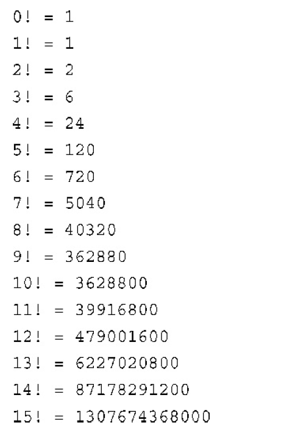

# 5.1 for loop

```cpp
// 5.1 forloop.cpp
#include<iostream>
int main()
{
	using namespace std;
    int i;
    for(i = 0;i < 5;i++)
       cout <<　"C++ Loops.\n";
    cout << "Stop Loops" << endl;
    return 0;
}
```

## 0.for循环的组成部分

1．设置初始值。

2．执行测试，看看循环是否应当继续进行。

3．执行循环操作。

4．更新用于测试的值。

```cpp
#include<iostream>
int main()
{
	using namespace std;
    int limit;
    cin >> limit;
    for(i=limit;i;i--)
        cout << "i=" << i << endl;
    cout << "Final:" << i << endl;
    return 0;
}
// 4,3,2,1,最后是0(省略了换行)
```

>   底层:判断式用了bool变量,满足判断式为`True`,否则为`False`
>
>   需要注意的是:这里的`updata_expr`不是直接进入的
>
>   >   也就是满足条件的话不会执行`expression`
>
>   程序流程:`init_expr`->`test_expr`->`statement`->`update_expr`->`test`

## **1.表达式`expression`和语句**

需要额外注意的就是赋值表达式(括号优先,从右往左的顺序)

`maids = (cook = 4) + 3;`表示`maids`直接被赋值为7

```cpp
// 5.3 express.cpp
#include<iostream>
int main()
{
	using namespace std;
   int x;
   cout << (x = 100) << endl;  // 100
   cout << x << endl;		    // 100
   cout << (x < 3) << endl;	// 0
   cout << (x > 3) << endl;	// 1
   cout.setf(ios_base::boolalpha); // C++新特性
   cout << (x < 3) << endl;	// false
   cout << (x > 3) << endl;	// true
   return 0;
}
```

**`表达式的副作用`:当判断表达式`x=100`的时候,我们需要赋值判断**

>   改变了原来内存中的函数值,因此存在副作用

**从表达式到语句的方式:直接添加分号`;`即可**

>   但是不一定有编程意义,比如`rodents + 6;`

**新的`for-init-expression`**

>   `for(int i = 0;i < 5;i++)`
>
>   >   但是循环结束以后,该变量消失

## **2.回到`for`循环**

>   ```cpp
>   // 5.4 formore.cpp
>   #include<iostream>
>   const int ArSize = 16; // external declaration
>   int main()
>   {
>       long long factorials[ArSize];
>        factorials[0]  = factorials[1]= 1LL; 
>        // 其实是1,但是后缀了longlong,避免当作普通int处理
>        for(int i = 2; i < ArSize; i++)
>            factorials[i] = i * factorials[i-1];
>        for(int i = 0; i < ArSize; i++)
>            std::cout << i << factorials[i] << std::endl;
>        return 0;
>   }
>   // 从0~15,共16个数
>   ```
>



## **3.修改步长**

**也就是设置步长为除了`i++`(单次递增1)的大小**

```cpp
// 5.5 bigstep.cpp
#include<iostream>
int main()
{
	using std::cout;
   using std::cin;
   using std::endl;
   int by;
   cin << by;
   cout << by << endl;
   for(int i=0;i<100;i=i+by)
       cout << i << endl;
   return 0;
}
```

## **4.使用`for`循环访问字符串**

```cpp
// forstr1.cpp
#include<iostream>
#include<string>
int main()
{
    using namespace std;
    string word;
    cin >> word;
    for (int i=word.size() - 1;i>=0;i--) //会输出整个单词
        cout << word[i];  // 会输出单个字母(无间隔)
    cout << "end" << endl;
    return 0;
}
```

## **5.递增运算符`++`递减运算符`--`**

需要注意前缀版本和后缀版本,对操作数的影响相同,但是影响时间不同

```cpp
// plus_one.cpp
#include<iostream>
int main()
{
   using std::cout;
   int a = 20;
   int b = 20;
   cout << a << " " << b << endl;  // 20 20
	cout << a++ << " " << ++b << endl;// 20 21
   cout << a << " " << b << endl; // 21 21
   return 0;
}
```

## **6.副作用和顺序点**

**副作用是再计算表达式时,对某些东西(一般是值)进行了修改**

**顺序点是程序执行过程中的一个点,进入下一步前确保对所有副作用进行了评估**

```cpp
while(guest++ < 10)
   cout << guests << endl;
```

**`在这里,其实是先执行了guest++,所以其实是从1~10的输出`**

```cpp
#include <iostream>
using namespace std;

int main()
{  
  int x =0,y = 0;
  y = (4 + x++) + (6 + x++);
  // 一种UB行为,因为'+'不是顺序点,两个分句可以交错进行(看编译器)
  cout << y << endl; // 11
  cout << x << endl; // 2
  // 其中一个自增操作在计算y的时候可能会被跳过
  return 0;
}
```

## **7.前缀格式和后缀格式**

还是`++x`和`x++`,前面已经讲述过,虽然最后的结果一样,但是执行时间不同

**但是实际上`++x`的效率比`x++`高,后者需要先复制一个副本,然后+1**

## **8.递增/递减运算符和指针**

递增运算符用于指针时,将把指针的值增加到`一个数据类型占用的字节数`

```cpp
double arr[5] = {21.1,32.8,23.4,45.2,37.4};
double *pt = arr;
++pt;
// 优先级如下:
// 后缀递增(p++),后缀递减(p--)  (左往右)
// 前缀递增(++p),前缀递减(--p),解除引用(*)的优先级相同 (右往左)
double x  = *++pt;	// 先自增,再解除引用
(*pt)++;	// 先解除引用,再自增
x = *pt++   // ++先作用域pt,让pt的地址自增,然后再解引用,最后赋值
```

## **9.组合赋值运算符`+=`**

一种简洁的语法`+=`将两个操作数相加然后赋值

```cpp
int k = 5;
k += 3;					// k=8
int *pa = new int[10];  // pa->pa[0]
pa[4] = 12;				
pa[4] += 6;				// pa[4] = 18
*(pa + 4) += 7;			// pa[4]  = 25
pa += 2;				// pa->pa[2]
// 34 +=10;				// INVALID
```

还有`+=`,`-=`,`*=`,`/=`,`%=`

## **10.复合语句(语句块)**

即使用花括号将迭代部分注目

**因为`使用缩进`只能将第一条语句放在循环中**

```cpp
#include <iostream>
using namespace std;

int main()
{  
  for(int i =0;i<9;i++)
	   cout << i;
	   cout << "CIEL" << endl;
  return 0;
}
// 012345678CIEL
```

**同时语句块不能乱用,因为语句块内的变量只能在语句块内部使用**

```cpp
#include<iostream>
int main()
{
	using namespace std;
   int x = 20;
   {
       int y = 100;
       int x = 100;
       cout << x << endl;
       cout << y << endl;
   }
   cout << x << endl; // original x = 20
   cout << y << endl; // INVALID
   return 0;
}
```

## **11.逗号运算符**

也就是单行重复声明:`+-j,--i;`或者`int i,j`

```cpp
// 5.9 forstr2.cpp
#include<iosream>
#include<string>
int main()
{
	using namespace std;
   string word;
   cin >> word; // 比如parts
   char temp;
   int i,j;
   for (j = 0;i = word.size() - 1;j<i;--i,--j)
   {
       temp = word[i];
       word[i] = word[j];
       word[j] = temp;
   }
   // word[0]和word[4]交换
   // word[1]和word[3]交换
   cout << word << endl;
   return 0;
}
```

**除了作为同时处理的信号,还作为`顺序点`,`.`前先计算,然后后计算**

>   比如`i=20,j=2*i;`首先完成i的赋值,然后完成j的赋值

**同时C++规定逗号运算符的优先级最低**

>   `cats = 17,240;`解释为`(cats = 17),240;`,最后设置为17(240不起作用)

## **12.关系表达式**

`<`,`<=`,`==`,`>=`,`!=`

## **13.赋值和比较**

>   额外注意`=`表示赋值,然而`==`表示比较
>
>   如果for循环语句中的`比较判断式`写成了`赋值式`会导致无法终止

## **14.C-风格字符串的比较**

需要知道如果`word`是数组名:`word == "mate"`的判断不成立

(因为`word`其实代表的是数组的地址,更详细的,是第一个地址)

应该使用`strcmp()`函数进行比较,判断表达式比较`char`是可行的

**需要额外注意:C++中存储在不同数组的相同字符串是相同的**

>   在BASIC和Pascal中不是

```cpp
// 5.11 compstr1.cpp
#include<iostream>
#include<cstring>
int main()
{
    using namespace std;
    char word[5] = "?ate";
    for(char ch = 'a';strcmp(word,"mate");ch++)
    {
        cout << word << endl;
        word[0] = ch;
    }
    cout << word << endl;
    return 0;
}
/* output:
?ate
aate
bate
cate
date
eate
fate
gate
hate
iate
jate
kate
late
mate
*/
```

## **15.比较string类字符串**

```cpp
// 5.12 compstr2.cpp
#include<iostream>
#include<string>
int main()
{
   using namespace std;
   string word = "?ate";
   fot (char ch = 'a';word != "mate";ch++)
   {
       cout << word << endl;
       word[0] = ch;
   }
   cout << word << endl;
   return 0l
}
// 这里使用了重载的!=进行了字符串的比较
```

