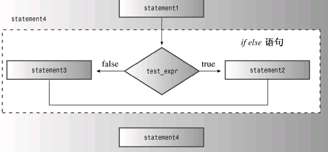

# 6.1 if-statement

```cpp
// 6.1 if.cpp
#include<iostream>
int main()
{
    using std::cin;
    using std::cout;
    char ch;
    int spaces = 0;
    int total = 0;
    cin.get(ch);
    while(ch != '.')
    {
        if (ch == '')
            ++spaces:
        ++total;
        cin.get(ch);
    }
    cout << spaces << " " << total;
    return 0;
}
```

## 1.if-else 语句

`if else`语句则让程序决定执行两条语句或语句块中的哪一条

```cpp
if (condition)
    statement1;
else
    statement2;
```



```cpp
// ifelse.cpp
#include<iostream>
int main()
{
    char ch;
    std::out << "Test" << endl;
    std::cin.get(ch);
    while(ch != '.')
    {
        if(ch == '\n')
            std::cout << ch;
        else
            std::cout << ++ch;
        std::cin.get(ch);
    }
    return 0;
}
```

## 2.格式化`if-else`(使用大括号)

```cpp
if (ch == 'Z')
{
    zorro++;
}
else
{
    dull++;
}
```

## 3.if-elseif-else语句

**以下两种表述是完全不同的(else的位置)**

```cpp
if(ch == 'A')
    a_grade++;
else
    if(ch == 'B')
        b_grade++;
	else
        soso++;
```

```cpp
if(ch == 'A')
    a_grade++;
else
    if(ch == 'B')
        b_grade++;
else
        soso++;
```

```cpp
// 6.3 ifelseif.cpp
#include<iostream>
const int Fave = 27;
int main()
{
    using namespace std;
    int n;
    do
    {
        cin >> n;
        if (n < Fave)
            cout << "high" << endl;
        else if (n > Fave)
            cout << "low" << endl;
        else
            cout << "Right" << endl;
    }while(n!=Fave);
    return 0;
}
```

**然后是一种预防性编程方法(符号写错的情况),将比较值放在前面的判断**

>   比如`if(a == 3)`是合法的,`if(3 == a)`也是合法的
>
>   但是如果是`if(3 = a)(写错了)`则非法