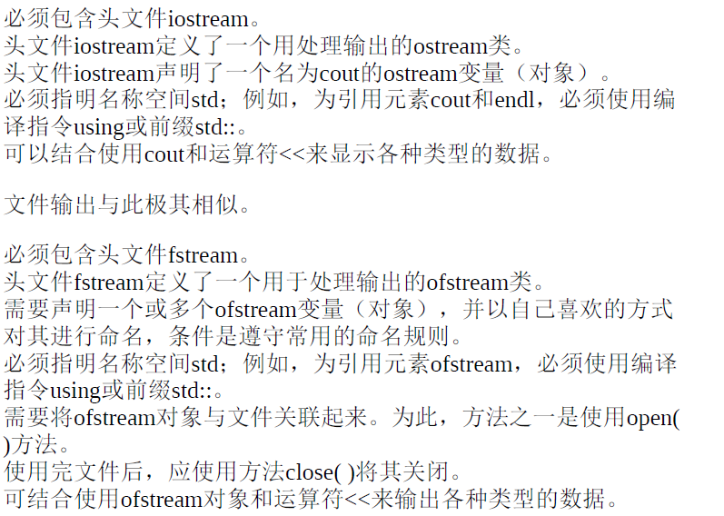

# 6.8 simple I/O files

## 1.文本I/O以及文本文件

**首先来看`cin`对于不同数据类型的读取方式**

>   `38.5 19.2`
>
>   1.`char`:输入行的第一个字符编码被存储在变量中->`ch = '3'`
>
>   2.`int`:cin会不断读取直到遇到非数字字符->`ch = 38`
>
>   3.`double`:cin会不断读取直到非浮点数->`ch = 38.5`
>
>   4.`char a[MAX]`:cin会不断读取直到遇到空白->`ch[] = '3''8''.''5''\0' `
>
>   5.使用`cin.getline`的`char a[MAX]`:cin直到遇到换行符才会停

## 2.写入到文本文件中

**1.有关`cout`对于控制台输出的基本事实**

>
>
>**必须声明自己的`ofstream`对象并且命名:**
>
>```cpp
>ofstream outFile;
>ofstream fout;
>outFile.open("fish.txt");
>char filenames[50];
>fout.open(filename);
>```
>
>`open()`方法接受一个C风格字符串作为参数
>
>```cpp
>double wt = 125.8;
>outFile << wt;
>char line[81] = "Objects are closer than they appear"
>fout << line << endl; // 写一行的txt
>```

**文件输出的主要步骤**

>   1.包含头文件`fstream`
>
>   2.创建一个`ofstream`对象
>
>   3.将`ofstream`和文件关联卡里
>
>   4.使用`outFile`/`cout`输出文件(`cout`更简单)

```cpp
// 6.15 outfile.cpp
#include<iostream>
#include<fstream>
int main()
{
	using namespace std;
    char automobile[50];
    int year;
    double a_price;
    double d_price;
    ofstream outFile; // 声明ofstream
    outFile.open('a.txt');
    // 如果没有文件,则创建该文件
    
    cin.getline(automobile,50);
    cin >> year;
    cin >> a_price;
    d_price = 0.913 * a_price;
    
    cout << fixed;
    cout.precision(2);
    // cout << x << setprecision(2) << endl; // 保留两位小数
    cout.self(ios_base::showpoint);
    cout << automobile << endl;
    cout << year << endl;
    
    // same as
    
    outFile << fixed;
    outFile.precision(2);
    outFile.setf(ios_base::showpoint);
    cout << automobile << endl;
    cout << year << endl;
    cout << a_price << endl;
    cout << d_price << endl;
    
    outFile.close();
    return 0;
}
```

## 3.读取文本文件

然后是基于控制台的输入,和刚刚一样,需要声明自己的`ifstream`对象

```cpp
ifstream inFile;
ifstream fin;

inFile.open("b.txt");
char filename[50];
cin >> filename;
fin.open(filename);

double wt;
inFile >> wt; // 从文本中读取一个数字
char line[81];
fin.getline(line,81); // 从文本中读取一行
```

**如果不存在用于输入的文件,会导致后面使用`ifstream`对象输入失败**

```cpp
inFile.open("b.txt");
if(!inFile.is_open())
{
    exit(EXIT_FAILURE); // 返回true和false
}
```

```cpp
// 6.16 sumafile.cpp
#include <iostream>  
#include <fstream>  
#include <cstdlib>   

const int SIZE = 60; // 定义一个常量，用于存储文件名的字符数组大小

int main()
{
	using namespace std;
    char filename[SIZE]; // 字符数组，用于存储用户输入的文件名
    ifstream inFile;     // 输入文件流对象


    cout << "请输入文件名: "; 
    cin.getline(filename, SIZE); 
    // 从用户输入中读取一行，存入 filename，最多读取 SIZE-1 个字符
    inFile.open(filename); 
    // 打开用户指定的文件，并将其与 inFile 文件流对象关联起来


    if (!inFile.is_open()) 
    {
        cout << "无法打开文件: " << filename << endl; 
        exit(EXIT_FAILURE); 
    }

    // --- 从文件读取和处理数据 ---
    double value;       // 用于临时存储从文件中读取的每一个数值
    double sum = 0.0;   // 用于累加所有从文件中读取的数值，初始化为0
    int count = 0;      // 计数器，用于记录成功读取了多少个数值

    // 尝试从文件中读取第一个 double 类型的数值，并存入 value 变量
    // >> 操作符会跳过空白（空格、制表符、换行符）
    inFile >> value; 

    // --- 循环读取文件 ---
    // inFile.good() 是一个关键的检查函数，它在以下情况下返回 true:
    // 1. 下一次读取操作可能成功。
    // 2. 没有发生任何错误（如类型不匹配）。
    // 3. 没有到达文件末尾。
    // 只要可以正常读取，循环就继续。
    while (inFile.good()) 
    {
        ++count;          // 读取成功，计数器加 1
        sum += value;     // 将读取到的值累加到 sum 中
        inFile >> value;  // 继续读取下一个数值，为下一次循环做准备
    }

    // --- 检查循环结束的原因 ---
    // 当循环结束时，意味着 inFile.good() 返回了 false。我们需要知道具体原因。
    
    // inFile.eof() : 如果读取到了文件末尾而导致读取失败，则返回 true。。
    if (inFile.eof())
        cout << "文件读取完毕。" << endl;

    // inFile.fail(): 如果是因为读取的数据类型不匹配（例如，期望读取数字但遇到了文本），
    // 或者到达文件末尾，该函数会返回 true。
    // 这里使用 else if 是因为我们想把“数据不匹配”和“正常读完(eof)”区分开。
    // 如果是 eof，上面的 if 已经处理了。如果不是 eof 但 fail() 为 true，那基本就是数据类型问题。
    else if (inFile.fail())
        cout << "读取终止：数据类型不匹配。" << endl;
    else
        cout << "未知错误导致读取终止。" << endl;
    if (count == 0)
        cout << "文件中没有有效数据。" << endl; 
    else
    {
        cout << "成功读取数值个数: " << count << endl;
        cout << "数值总和: " << sum << endl;
        cout << "平均值: " << sum / count << endl;
    }

    inFile.close(); // 关闭文件流，释放与文件相关的资源。这是一个好习惯。
    return 0; // 程序正常结束
}
```

