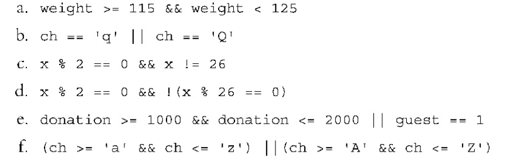
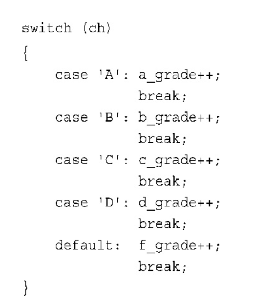

# 6.9 Homeworks

C++提供了if语句、if-else语句和switch语句来管理选项。if语句使程序有条件地执行语句或语句块，也就是说，如果满足特定的条件，程序将执行特定的语句或语句块。

`if else`语句程序选择执行两个语句或语句块之一。可以在这条语句后再加上`if else`，以提供一系列的选项。switch语句引导程序执行一系列选项之一。
C++还提供了帮助决策的运算符。第5章讨论了关系表达式，这种表达式对两个值进行比较。if和`if else`语句通常使用关系表达式作为测试条件。通过使用逻辑运算符`（&&、||、!）`，可以组合或修改关系表达式，创建更细致的测试。条件运算符`（?:）`提供了一种选择两个值之一的简洁方式。
`cctype`字符函数库提供了一组方便的、功能强大的工具，可用于分析字符输入。
对于文件`I/O`来说，循环和选择语句是很有用的工具；文件I/O与控制台I/O极其相似。声明`ifstream`和`ofstream`对象，并将它们同文件关联起
来后，便可以像使用cin和cout那样使用这些对象。

****

1．下面两个计算空格和换行符数目的代码,第二种格式比第一种格式好在哪里？

```cpp
// version1
while(cin.get(ch))
{
    if(ch == ' ')
        spaces++;
    if(ch == '\n')
        newlines++;
}
// version2
while(cin.get(ch))
{
    if(ch == ' ')
        spaces++;
    else if(ch == '\n')
        newlines++;
}
```

>`if else`版本的效率更高。例如，考虑当ch为空格时的情况。
>
>版本1对空格加1，然后看它是否为换行符。这将浪费时间，因为程序已经知道`ch`为空格，因此它不是换行符。
>在这种情况下，版本2将不会查看字符是否为换行符。

2．在程序清单6.2中，用`ch+1`替换`++ch`将发生什么情况呢？

>`++ch`和`ch + 1`得到的数值相同。
>
>但`++ch`的类型为`char`，将作为字符打印，
>
>而`ch + 1`是int类型（因为将char和int相加），将作为数字打印。

3．请认真考虑下面的程序：

```cpp
#include<iostream>
using namespace std;
int main()
{
    char ch;
    int ct1,ct2;
    ct1 = ct2 = 0;
    while((ch = cin.get()) != '$')
    {
        cout << ch;
        ct1++;
        if(ch = '$')
            ct2++;
        cout << ch;
    }
    cout << ct1 << ct2 << endl;
    return 0;
}
```

>   输出是(注意输入被缓冲)
>
>   ```cpp
>   Hi!
>   H$i$!$
>   $Send $10 or $20 now
>   S$e$n$d$ $ct1 = 9,ct2 = 9;
>   // 这里存在一个比较运算符变成赋值运算符的陷阱
>   ```

4．创建表示下述条件的逻辑表达式：

>```
>a．weight大于或等于115，但小于125。
>
>b．ch为q或Q。
>
>c．x为偶数，但不是26。
>
>d．x为偶数，但不是26的倍数。
>
>e．donation为1000-2000或guest为1。
>
>f．ch是小写字母或大写字母（假设小写字母是依次编码的，大写字母也是依次编码的，但在大小写字母间编码不是连续的）。
>
>```
>
>

5．在英语中，“I will not not speak（我不会不说）”的意思与“I will
speak（我要说）”相同。在C++中，!!x是否与x相同呢？

>不一定。
>
>如果x为10，则!x为0，!!x为1。
>
>然而，如果x为bool变量，则!!x为x。

6．创建一个条件表达式，其值为变量的绝对值。也是说，如果变
量x为正，则表达式的值为x；但如果x为负，则表达式的值为−x——这
是一个正值。

>   `(x < 0)? -x : x`

7．用switch改写下面的代码片段：

```cpp
if (ch == 'A')
    a_grade++;
else if (ch == 'B')
    b_grade++;
else if (ch == 'C')
    c_grade++;
else if (ch == 'D')
    d_grade++;
else
    f_grade++;
```

>

8．对于程序清单6.10，与使用数字相比，使用字符（如a和c）表示
菜单选项和case标签有何优点呢？（提示：想想用户输入q和输入5的情
况。）

>如果使用整数标签，且用户输入了非整数（如q），则程序将因
>为整数输入不能处理字符而挂起。但是，如果使用字符标签，而用户输
>入了整数（如5），则字符输入将5作为字符处理。然后，switch语句的
>default部分将提示输入另一个字符。

9．请重写该代码片段，不要使用break和continue语句。

```cpp
int line = 0;
char ch;
while(cin.get(ch))
{
    if(ch == 'Q')
        break;
    if(ch != '\n')
        continue;
    line++;
}
```

>```cpp
>int line = 0;
>char ch;
>while (cin.get(ch) && ch != 'Q')
>{
>    if(ch == '\n')
>        line++;
>}
>```