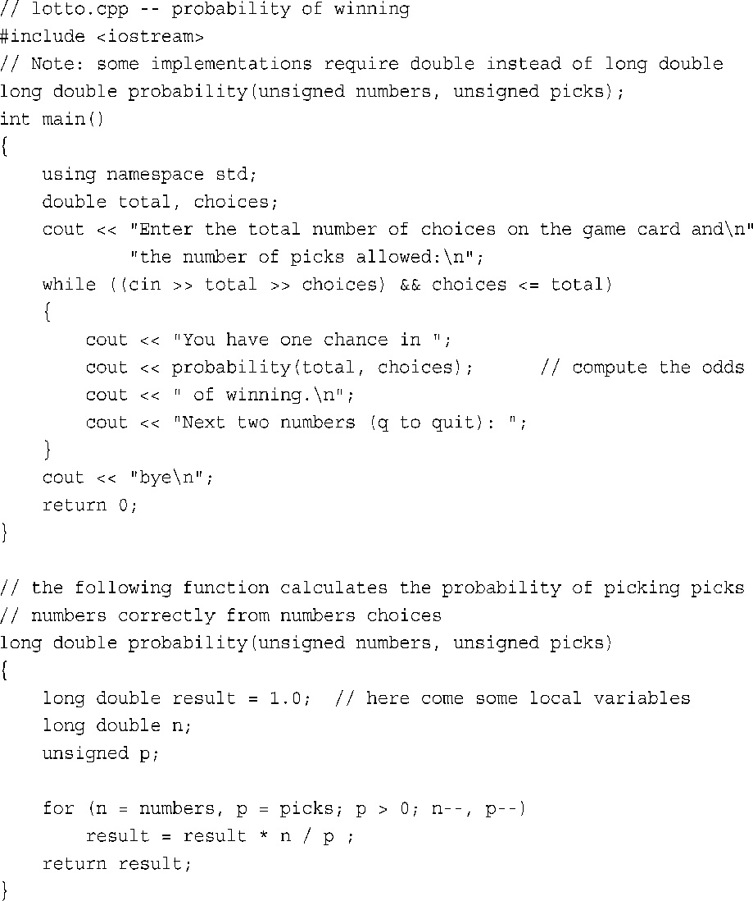

# 7.2 Function params

C++通常按值传递参数，这意味着将数值参数传递给函数，后者将其赋一个新名字

>   ```cpp
>   double volume = cube(side);
>   ```

**1.函数的多个参数**

>函数可以有多个参数,在调用的时候,将这些参数分开即可
>
>`n_char('R',25);`同时定义函数的时候`void n_char(char c, int n)`
>
>声明原型也是一样的`void n_char(char c, int n);`
>
>原型声明可以直接换为类型`void n_char(char, int);`

```cpp
// 7.3 twoarg.cpp
#include<iostream>
using namespace std;
void n_chars(char,int);
int main()
{
    int times;
    char ch;
    while(ch != 'q')
    {
        cout << "Enter a integer";
        cin >> times;
        n_chars(ch,times);
        cout << "Enter another character"
            	"or press the q-key to exit"
            cin >> ch;
    }
    cout << time << endl;
    cout << "Bye\n";
    return 0;
}
void n_chars(char c,int n)
{
    while(n-- >0)
        cout << c;
}
```

>   解释:使用一个`while`循环提供重复输入,同时`cin>>ch`会跳过空格和华航夫
>
>   `n_char`函数则是输出n次字符`c`

## 2.另外一个接受两个参数的函数

比如计算算式如下:

```math
R= \frac{51 \times 50 \times 49 \times 48 \times 47 \times 46}{6\times 5 \times 4 \times 3 \times 2 \times1}
```

```cpp
long double result = 1.0;
for (n = numbers,p = picks;p > 0; n--, p--)
    result = result * n / p;
```



>   运行结果如下:
>
>   