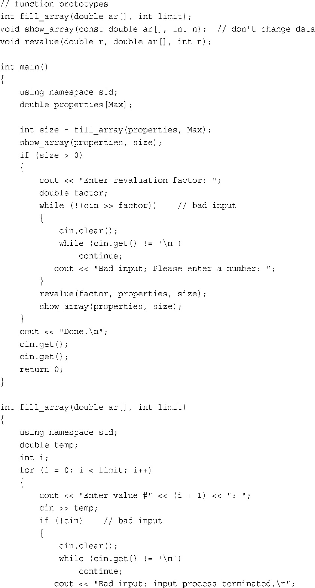
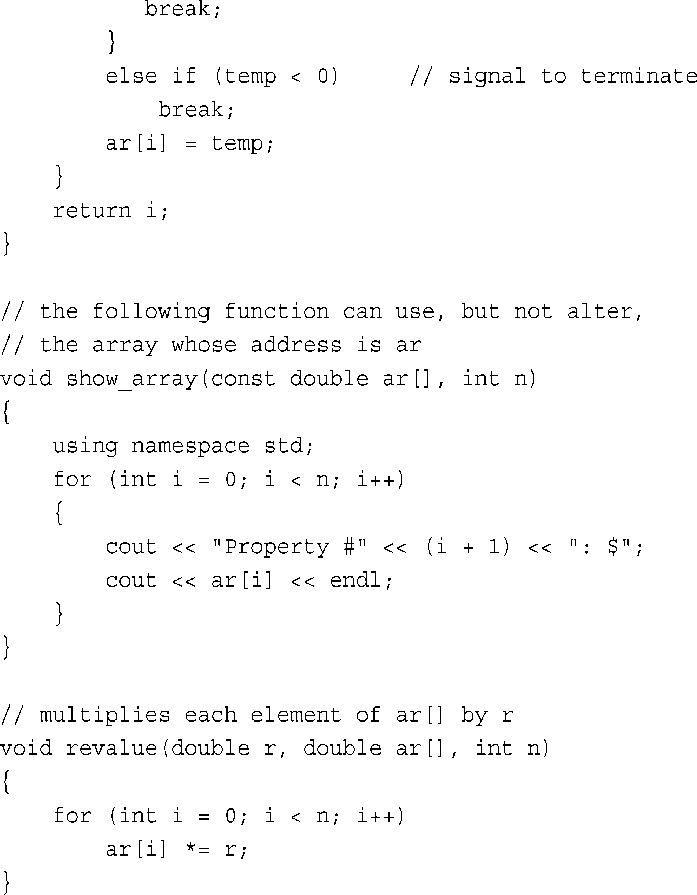
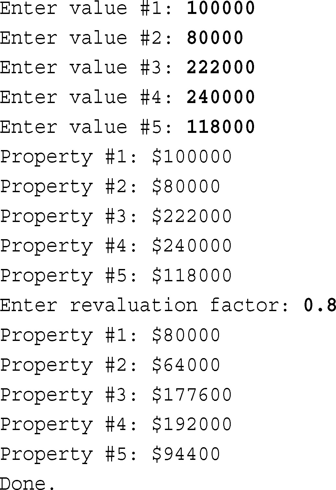

# 7.3 Function arrays

到目前为止，本书的函数示例都很简单，参数和返回值的类型都是基本类型。但是，函数是处理更复杂的类型（如数组和结构）的关键。下面来如何将数组和函数结合在一起。

>   `int sum_arr(int arr[],int n)`
>
>   ```cpp
>   // 7.5 arrfun1.cpp
>   #include<iostream>
>   const int ArSize = 8;
>   int sum_arr(int arr[],int n) // prototype
>   int main()
>   {
>       using namespace std;
>       int cookies[ArSize]  = {1,2,4,8,16,32,64,128};
>       int sum = sum_arr(cookies,ArSize);
>       cour << sum << endl;
>       return 0;
>   }
>   int sum_arr(int arr[],int n)
>   {
>       int total = 0;
>       for(int i = 0;i < n;i++)
>           total = total + arr[i];
>       return total;
>   }
>   ```

## 1.函数使用指针处理数组

C++将数组名视为指针,解释为第一个元素的地址

数组使用数组名标价存储位置,对数组使用`sizeof`可以得到数组的长度

将地址运算符`&`运用于数组名的时候,返回整个数组的地址

>   `int sum_arr(int *arr,int n)`
>
>   **这里使用`int *arr`来替代`int arr[]`,这两种写法都是对的**
>
>   **由于是一种指针表示法,所以数组表示法和指针表示法都是合法的**
>
>   ```cpp
>   arr[i] == *(ar + i);
>   &arr[i] == ar + i;
>   ```

## 2.数组作为参数的使用

**一句话:数组传递的时候当然是传递的地址,而不是数组的内容**

```cpp
// arrfun2.cpp
#include<iostream>
const int ArSize = 8;
int sum_arr(int arr[],int n);
int main()
{
    int cookies[ArSize] = {1,2,4,8,16,32,64,128};
    std::cout << cookies << std::endl;
    std::cout << sizeof(cookies) << std::endl;
    int sum = sum_arr(cookies,ArSize);
    std::cout << sum << std::endl;
    sum = sum_arr(cookies,3);
    std::cout << sum << std::endl;
    sum = sum_arr(cookies + 4,4);
    std::cout << sum << std::endl;
    return 0;
}
int sum_arr(int arr[],int n)
{
    int total;
    std::cout << arr << std::endl;
    std::cout << sizeof(arr) << std::endl; 
    for(int i = 0;i<n;i++)
        total = total + arr[i];
    return total;
}
```

>   **需要注意的是虽然是相同的数组,理论上`sizeof()`应该结果相同**
>
>   **但是`cookies`是全部的数组大小,`arr`只是指针变量的长度(更小)**
>
>   `arr`的具体大小要看系统的字节地址数

## 3.更多数组

选择使用数组来表示数据时，实际上是在进行一次设计方面的决策。但设计决策不仅仅是确定数据的存储方式，还涉及到如何使用数据。

程序员常会发现，编写特定的函数来处理特定的数据操作是有好处的（这里讲的好处指的是程序的可靠性更高、修改和调试更为方便）。
另外，构思程序时将存储属性与操作结合起来，便是朝OOP思想迈进了重要的一步；以后将证明这是很有好处的。**(功能函数)**

**1.填充数组**

>**从用户那里获取输入来填充一个double类型的数组，直到数组被填满、用户输入了非数字内容或者输入了一个负数为止。**
>
>```cpp
>int fill_array(double ar[],int limit);
>int fill_array(double ar[],int limit)
>{
>	using namespace std;
>    double temp;
>    int i;
>    for(i=0;i<limit;i++)
>    {
>        cout << "Value is" << i+1;
>        cin >> temp;
>        if(!cin)
>        {
>			cin.clear();
>            while(cin.get() != '\n')
>                continue;
>            cout << "Bad input" << endl;
>            	break;
>        }
>        else if(temp < 0)
>            break;
>        ar[i] = temp;
>    }
>    return 1;
>}
>```

**2.显示数组以及`const`保护数组**

>C++对于普通params的方式:按值传递(创建一个副本供函数使用)
>
>C++对于数组params的方式:按地址传递(**所以会导致原始数据被修改**)
>
>>   **解决方法:`const`关键字**
>
>```cpp
>void show_array(const double ar[], int n)
>{
>	using namespace std;
>    for(int i=0;i<n;i++)
>    {
>        cout << (i+1) << ":$";
>        cout << ar[i] << endl;
>    }
>}
>```

**3.修改数组**

>   ```cpp
>   void revalue(double r,double ar[],int n)
>   {
>       for(int i=0;i<n;i++)
>           ar[i] *= r;
>   }
>   ```

## 3.代码整合





>   **运行结果:**
>
>   

**常用的编码模板:**

>如果编写处理double数组的函数:`void f_modify(double arr[], int n);`
>
>如果不修改数组本体:`void _f_no_change(const double ar[], int n);`
>
>(当然还是可以省略变量名)

## 4.使用数组区间的函数

**一般数组函数的`params`:起始处的指针+数组长度**

>   所以这里提供了另一种信息:元素区间(range)使用双指针完成(开头结尾)
>
>   C++ STL将区间方法广义化了

比如`double elbuod[20]`中,`elboud`和`elboud + 19`是第一个和最后一个元素

```cpp
// arrfun4.cpp
#include<iostream>
const int ArSize = 8;
int sum_arr(const int* begin,const int* end);
int main()
{
    using namespace std;
    int cookies[ArSize] = {1,2,4,8,16,32,64,128};
    int sum = sum_arr(cookies,cookies + ArSize);
    sum = sum_arr(cookies,cookies + 3);
    cout << sum << endl;
    sum = sum_arr(cookies + 4,cookies + 8);
    cout << sum << endl;
    return 0;
}
//使用*arr代替arr[],这里强调是整型指针
int sum_arr(const int* begin,const int* end)
{
    const int* pt;
    int total = 0;
    for (pt = begin;pt != end;pt++)
        total = total + *pt;
    return total;
}
// sum = sum_arr(cookies,cookies + ArSize)
// sum = sum_arr(cookies,cookies + 3)     // first 3 elements
// sum = sum_arr(cookies + 4,cookies + 8) // last 4 elements
```

## 5.指针和`const`

**指针和`const`的配合1:让指针指向一个常量对象,防止更改指针指向的值**

**指针和`const`的配合2:将指针本身声明为常量,防止更改指针的位置**

>   ```cpp
>   int age = 39;
>   const int* pt = &age;
>   *pt += 1;   // INVALID const int
>   *pt = 20;	// INVALID const int
>   cin >> *pt; // INVALID const int
>   
>   age = 20 	// VALID
>   ```
>
>   比较微妙:整体看`age`并不是`const`,但是对于`pt`而言就是`const`

>**一阶间接关系:`const`和指针的基础**
>
>```cpp
>// 常量和指针的关联
>const float g_earth = 9.80;
>const float* pe = &g_earth;  // VALID
>
>const float g_moon = 1.63;   // INVALID
>float* pm = &g_moon;
>```
>
>>   **第一种情况:不能通过常量赋值和指针赋值来修改`9.80`**
>>
>>   **第二章情况:禁止将`const的地址`传递给`非const指针`,因为没有意义**
>
>```cpp
>// 指针和指针的关联
>int age = 39;		// age++ 修改合法
>int *pd = &age;		// *pd = num 赋值合法
>
>// *pt指向pd,一级间接关系,const指向非const
>const int* pt = pd  // "我不会通过pt修改pd(即age的值)"
>// *pt = 42 不合法,不能修改
>// pt = &another_int 合法
>
>// 表示指针指向一个常量,并且后序也不能修改位置
>int* const p_const = &val; // 声明时初始化
>// *p_const = 1; // 合法
>// *p_const = &val2 // INVALID
>
>const int* const pt = &place // 值和位置都不能修改
>```
>
>```cpp
>// 修改两级间接关系(直接用一阶间接关系表示比较危险)
>/*
>a 是一个宝藏。
>p1 是一张藏宝图，上面写着宝藏 a 的位置。
>pp2 是一个信封，里面装着那张藏宝图 p1。
>如果想知道a,则解包*p1,则**pp2
>*/
>
>const int **pp2;
>int *p1;
>const int n = 13;
>pp2 = &p1;  // not allow,因为会修改const的变量值
>
>*pp2 = &n;	// VALID,both const
>*p1 = 10;	// VALID,but change const n
>```
>
>