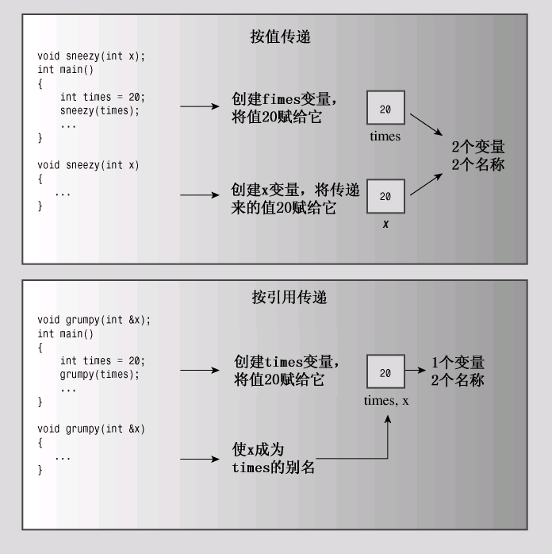

# 8.2 Reference variables

**C++新增了一种复合类型——引用变量。**

>   引用是已定义的变量的别名（另一个名称）。引用变量的主要用途是用作函数的形参。**通过将引用变量用作参数，函数将使用原始数据，而不是其副本。**
>
>   这样除指针之外，引用也为函数处理大型结构提供了一种非常方便的途径，同时对于设计类来说，引用也是必不可少的。然而，介绍如何将引用用于函数之前，先介绍一下定义和使用引用的基本知识。请记住，下述讨论旨在说明引用是如何工作的，而不是其典型用法

## 1.创建引用变量

前面讲过，C和C++使用&符号来指示变量的地址。C++给&符号赋
予了另一个含义，将其用来声明引用。例如，要将rodents作为rats变量
的别名，可以这样做:

```cpp
int rats;
int & rodents = rats;
```

>其中，&不是地址运算符，而是类型标识符的一部分(指向int的引用)

```cpp
// 8.2 firstref.cpp
#include<iostream>
int main()
{
    using namespace std;
    int rats = 101;
    int & rodents = rats; // reference
    cout << rats << rodents << endl;
    rodents++;
    cout << rats << rodents << endl;
    cout << &rats;		  // address
    cout << &rodents << endl;
    return 0;
}
```

>   结果是`rats`和`rodents`的值和地址完全相同,修改一个就会同时改变两个值
>
>   **和指针地址的差别是:在声明的时候就需要初始化(类似`const`)**
>
>   ```cpp
>   int & rodents = rats;
>   int * const pr = &rats; // 上面代码的完整形式
>   ```

**`&`的连锁修改性**

```cpp
// secref.cpp
#inlcude<iostream>
{
    using namespace std;
    int rats = 101;
    int & rodents = rats;
    cout << rats << endl;
    cout << rodents << endl;
    cout << &rats << endl;
    cout << &rodents << endl;    
    
    int bunnies = 50;
    rodents = bunnies;
    // 尝试修改reference的对象,结果把源对象的值给修改了
    // 一种不同于const的严格方式,可以对变量值和变量引用进行重赋值
    cout << bunnies << endl;
    cout << rats << endl;
    cout << rodents << endl;
    cout << &bunnies << endl;
    cout << &rodents << endl;    
    return 0;
   
}
```

>   **当然之前提到`&`的位置是`const`不可修改**
>
>   ```cpp
>   int rats = 101;
>   int *pt = &rats;
>   int &rodents = *pt;
>   int bunnies = 50;
>   pt = &bunnies;	// 即使引用在指针上,也并不会修改一开始引用的值
>   ```

## 2.将引用用作函数参数

**<font color=red>永远不要返回对局部变量的引用或指针</font>**

引用经常被用作函数参数，使得**函数中的变量名成为调用程序中的变量的别名**

>   **这种传递参数的方法称为按引用传递**
>
>   (按值传递:2个变量,2个名称;按引用传递:1个变量,2个名称)
>
>   

```cpp
// 8.4 swaps.cpp
#include<iostream>
void swapr(int &a,int &b);
void swapp(int *p,int *q);
void swapv(int a,int b);
int main()
{
    using namespace std;
    int wallet1 = 300;
    int wallet2 = 350;
    cout　<< wallet1 << " " << wallet2 << endl;
    swapr(wallet1,wallet2); // address,使用实参直接初始化a和b
    cout　<< wallet1 << " " << wallet2 << endl;
    swapp(&wallet1,&wallet2);
    cout　<< wallet1 << " " << wallet2 << endl;
    // swap fail
    swapv(wallet1,wallet2); 
    cout　<< wallet1 << " " << wallet2 << endl;
	return 0;
}
// 注意这里要求传入的参数必须为int,否则需要添加const关键字创建临时变量)
void swapr(int &a,int &b)
{
    int temp;
    temp = a;
    a = b;
    b = temp;
}
void swapp(int *p,int *q)
{
    int temp;
    temp = *p;
    *p = *q;
    *q = temp;
}
// 没有正确修改的原因:a和b位置变化了,但是原来的变量没有修改
void swapv(int a,int b)
{
    int temp;
    temp = a;
    a = b;
    b = temp;
}
```

## 3.引用的属性和特别

```cpp
// 8.5 cubes.cpp
#include<iostream>
double cube(double a);
double refcube(double &a);
int main()
{
    using namespace std;
    double x = 3.0;
    cout << cube(x) << x << endl;   // 27 3
    cout << refcube(x) << x << endl;// 27 27
    return 0;
}
double cube(double a)
{
	a *= a * a;
    return a;
}
double refcube(double &ra)
{
	ra *= ra * ra;
    return ra;
}
```

>   还是和之前的原因一样,cube使用了按值传递,导致原来的x值没有修改
>
>   如果意图是:**仅作为参数读取,则加上`const`关键字**
>
>   ```cpp
>   double refcube(const double &ra);
>   ```
>
>   **同时传递的是值而不是表达式**
>
>   ```cpp
>   // double z = refcube(x + 3.0); INVALID
>   ```
>
>   (原因是无法控制临时变量的生命周期)

**临时变量,引用参数和`const`**

>   如果实参和引用参数不匹配,则会生成临时变量(仅当前参数为`const引用`)
>
>   **生成临时变量的条件**
>
>   >   实参的类型正确,但不是左值
>   >
>   >   实参的类型不正确,但可以转换为正确的类型
>   >
>   >   (左值参数:可被引用的对象,比如变量/数组元素/结构成员/引用/指针)
>   >
>   >   (非左值参数:字面常量和包含多项的表达式)
>
>   ```cpp
>   double refcube(const double &ra);
>   double side = 3.0;
>   double * pd = &side;
>   double & rd = side;
>   long edge = 5L;
>   double lens[4] = {2.0,5.0,10.0,12.0};
>   double c1 = refcube(side);
>   double c2 = refcube(lens[2]);
>   double c3 = refcube(rd);
>   double c4 = refcube(*pd);
>   // 一下情况ra是临时变量,会被正确运算
>   double c5 = refcube(edge);		  // 5.0*5.0*5.0
>   double c6 = refcube(7.0);		  // 7.0*7.0*7.0
>   double c7 = refcube(side + 10.0); // 13*13*13
>   double refcube(const double &ra)
>   {
>       return ra * ra * ra;
>   }
>   ```
>
>   **带来的好处:不局限于`double`类型变量,使得其它变量也可以进行计算**
>
>   (自动进行了cast转化,甚至支持不同返回值函数的嵌套转换)
>
>   **`const`保证了这个临时变量不会被修改,使用后就消失**
>
>   >   使用`const`可以避免无意间的修改数据
>   >
>   >   使用`const`可以同时处理`const`和非`const`实参
>   >
>   >   使用`const`可以让函数正确生成临时变量
>
>   **右值引用:可以指向右值,使用`&&`声明**
>
>   >   ```cpp
>   >   double && ref = std::sqrt(36.00);
>   >   double j = 15.0;
>   >   double && jref = 2.0 * j + 18.5;
>   >   ```

## 4.将引用用于结构

引用十分适合用于结构和类,而不是基本的内置类型

```cpp
// prrototype
void set_pc(free_throws & ft);
void set_pc(const free_throws & ft);
struct free_throws
{
	std::string name;
    int made;
    int attempts;
    float percent
};

```

```cpp
// 8.6 strtref.cpp
#include<iostream>
#include<string>
struct free_throws
{
    std::string name;
    int made;
    int attempts;
    float percent;
};
void display(const free_throws & ft);
void set_pc(free_throws & ft);
free_throws & accumulate(free_throws & target,const free_throws & source); // 相当于两个const&引用
int main()
{
	free_throws one = {"Ifelsa Branch",13,14};
    free_throws two = {"Andor Knott",10,16};
    free_throws three = {"Minnie Max",7,9};
    free_throws four = {"Whily Looper",5,9};
    free_throws five = {"Long Long",6,14};
    free_throws team = {"Throwgoods",0,0};
    
    free_throw dup;
    // 4 functions
    set_pc(one);
    display(one);
    accumulate(team,one);
    display(team);
    // using return value as argument
    display(accumulate(team,two));
    accumulate(accumulate(team,three),four);
    display(team);
    // using return value in assignment
    dup = accumulate(team,five); // 将整个结构都复制到一个临时位置
    display(team);
    display(dup);
    set_pc(four);
    // ill-advised assignment 不明智的赋值
    // 首先会通过&修改dup本身(accumulate方法)
    // 然后返回一个对dup对象的引用
    accumulate(dup,five) = four;
 // 相当于accumulate(dup,five);dup=four;(使用five初始化然后修改为four)
    display(sup);
    return 0;
}
void display(const free_throws & ft)
{
    using std::cout;
    cout << ft.name << endl;
    cout << ft.made << endl;
    cout << ft.attempts << endl;
    cout << ft.percent << endl;
}
// 这里使用了引用,避免只修改了函数中的实参
void set_pc(free_throws & ft)
{
    if(ft.attempts != 0)
        ft.percent = 100.0f * float(ft.made)/float(ft.attempts);
    else
        ft.percent = 0;
}
// 这里的返回值是一个结构体同时通过&修改,函数名是accumulate,两个参数
// 如果没有&表示返回的是函数中结构体的副本
free_throws & accumulate(free_throws & target,const free_throws & source)
{
	target.attempts += source.attempts;
    target.made += source.made;
    set_pc(target);
    return target;
}
```

>   首先是创建了一个实例(只有一个值被初始化,余下的成员都将设置为0)

>   `set_pc`的另一种写法(通过指针参数传递地址而非引用)
>
>   ```cpp
>   void set_pcp(free_throws *pt)
>   {
>   	if(pt->attempts != 0)
>           pt->percent = 100.0f * float(pt->made)/float(pt->attempts);
>       else
>           pt->percent = 0;
>   }
>   ```

>   2.为什么返回的是引用
>
>   传统返回值和按值传递类似,计算return后面的表达式,然后返回
>
>   (这里的值被复制到一个临时位置,然后再计算)
>
>   如果使用的是`&`则返回一个结构,而不是指向结构的引用

>   3.返回引用的时候注意的问题
>
>   需要避免返回生命周期只在函数内部的内存单元引用
>
>   ```cpp
>   const free_throws & clone2(free_throws &ft)
>   {	
>       // 1.安全的写法(大多数情况下不会产生额外的拷贝)
>       free_throw newguy;
>       newguy = ft;
>       return newguy;  
>       // 2.不推荐的写法(*pt = ft会将内容拷贝到pt指向的随机内存地址)
>       free_throws * pt;
>       *pt = ft;
>       return *pt;
>       // 3.使用智能指针(#include<memory>)
>       std::unique_ptr<free_throws>clone3(const free_throws &ft)
>       {
>           std::unique_ptr<free_throws>pt = std::make_unique<free_throws>();
>           *pt = ft;
>           return pt;
>       }
>   }
>   ```

>   4.左值和右值RE
>
>   左值:可以定位的有内存地址的值/右值:没有定位的没有内存地址的值
>
>   常规返回的是右值
>
>   ```cpp
>   int get_value(){return 5;}
>   // get_value() = 10 INVALID
>   ```
>
>   返回引用的是左值
>
>   ```cpp
>   accumulate(dup,five) = four; // 返回的是引用
>   // 所以accumulate(dup,five)就是参数dup结构体的别名
>   ```
>
>   **所以可以添加`const`关键字来形成不可修改的左值**

## 5.将引用运用于类对象

类对象传递给函数的时候,C++的通常做法是使用引用

>   比如使用引用,将类`ostream`等作为参数传给函数

```cpp
// 8.7 strquote.cpp
#include<iostream>
#inclued<string>
using namespace std;
string version1(const string & s1,const string & s2);
const string & version2(string & s1,string & s2);
const string & version3(string & s1,const string & s2);
int main()
{
    string input;
    string copy;
    string result;
   	getline(cin,input);
    copy = input;
    result = version1(input,"***");
    cout << result << endl;
    result = version2(input,"###");
    cout << result << endl;
    result = version3(input,"@@@");
    cout << result << endl;
    input = copy;
    result = version3(input,"@@@");
    cout << result << endl;
    return 0;
}
// 这里使用const的重要原因:传入的参数是(string,const char*)自动类型转换
// string类有面对string对象和C-Style对象的处理能力
string version1(const string & s1,const string & s2)
{
    string temp;
    temp = s1 + s2 + s3;
    return temp;
    // 这里temp不使用string &的原因在于它最后会消失,所以引用会无效
}

// !!SideEffect!! 修改了原字符串面量
const string & version2(string & s1,string & s2)
{
    s1 = s2 + s1 + s2;
    return s1;
}

// !!BadDesign!!
const string & version3(string & s1,const string & s2)
{
    string temp;
    temp = s2 + s1 + s2;
    return temp; // 程序试图引用已经释放的内存。
}
```

>   **总之就是,生命周期仅在当前函数中的对象 + 返回引用 的组合造成UB**
>
>   函数在`return temp;`以后立即释放,导致再回到主函数赋值时找不到具体值

## 6.对象,继承和引用

Chap6中使用了`ofstream`处理文件,然而它时`ostream类`的方法

>   这样使得文件输入/输出的格式和控制台的输入输出相同
>
>   (即`ostream`是基类,而`ofstream`是派生类)

**基类引用可以直接指向派生类对象,无需进行强制`cast`**

>   也就是说**函数参数类型**是基类,可以让**基类**或**派生类**作为参数

```cpp
// 8.8 filefunc.cpp
#include<iostream>
#include<fstream>
#include<cstdlib>
using namespace std;
void file_it(ostream &os,double fo,const double fe[],int n);
// 这里的Prototype中声明了os的类型为ostream
const int LIMIT = 5;
int main()
{
    ofstream fout;
    const char * fn = "ep-data.txt";
    fout.open(fn);
    if(!fout.is_open())
    {
        cout << "Open Failed\n";
        exit(EXIT_FAILURE);
    }
    double objective;
    cin >> objective;
    double eps[LIMIT];
    for(int i = 0,i < LIMIT ;i++)
    {
        cout << i+1 << ":";
        cin >> eps[i];
    }
    file_it(fout,objective,eps,LIMIT);
    file_it(cout,objective,eps,LIMIT);
    cout << "DONE\n";
    return 0;
}
void file_it(ostream &os,double fo,const double fe[],int n){
    ios_base:fmtflags initial;
    initial = os.setf(io::base::fixed);
    os.precisioni(0);
    os << "Focal Length" << fo << "mm\n";
    os.setf(ios::showpoint);
    os.precision(1);
    os.width(12);
    os << "f.l.eyepiece";
    os.width(15);
    os << "magnification" << endl;
    for(int i=0;i<n;i++)
    {
        os.width(12);
        os << fe[i];
        os.width(15);
        os << int (fo/fe[i] + 0.5) << endl;
    }
    os.setf(initial);
}
```

>   参数`os`(`ostream &`可以指向`ostream`对象和`ofstream`对象
>
>   方法`setf()`能设置各种格式化状态:
>
>   >   `setf(ios_base::fixed)`将对象置于定点表示法的模式
>   >
>   >   `setf(ios_base::showpoint)`将对象置于小数点表示的模式
>
>   方法`width()`用于设置(仅下一次)输出使用的字段宽度
>
>   方法`setf()`返回调用它之前有效的所有格式化设置
>
>   方法`ios_bae::fmtflags`是存储这种信息所需的数据类型格式
>
>   ```cpp
>   // 1.初始化一个记录
>   ios_base::fmtflags initial;
>   // 2.将修改前的格式保存到initial中,然后修改为浮点数显示
>   initial = os.setf(ios_base::fixed)
>   ...
>   // 3.修改回原来的显示格式
>   os.setf(initial);
>   ```

## 7.何时使用引用参数

**使用引用参数的主要原因:**

>1.能够修改调用函数中的数据对象
>
>2.通过传递引用而不是复制整个数据对象

**传递对象的重要原则:**

>1.数据对象很小(内置数据类型/小型):按值传递
>
>2.数据对象是指针:声明为`const *`(唯一的方法)
>
>3.数据对象较大:使用`const`或者`const &`
>
>4.数据对象是类对象:使用`const &`(自动转换)

(额外不同的是`cin`本来就要修改原变量的值,自动带了`&`,直接`cin >> obj`)
