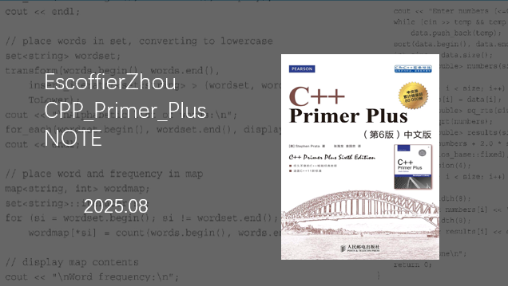

[Chap1 C++基本知识概论](https://github.com/EscoffierZhou/CPP_Primer_Plus_NOTE/blob/main/Chap1%20Introduction/1.0%20Chap1%20Introduction.md)

[Chap2 C++六大基本语句](https://github.com/EscoffierZhou/CPP_Primer_Plus_NOTE/blob/main/Chap2%20Start%20C%2B%2B/2.0%20Chap2%20Start%20C%2B%2B.md)

[Chap3 C++数据类型及类型转换](https://github.com/EscoffierZhou/CPP_Primer_Plus_NOTE/blob/main/Chap3%20Solve%20data/3.0%20Chap3%20Solve%20data.md)

[Chap4 C++基本数据结构](https://github.com/EscoffierZhou/CPP_Primer_Plus_NOTE/blob/main/Chap4%20Data%20structure/4.0%20Chap4%20Data%20structure.md)
